## Kubernetes and docker certifications info 


### k8s arch 


## kubeconfig file in client side 


## setting up config 


### history 

```
❯ kubectl  get   nodes
NAME          STATUS   ROLES                  AGE   VERSION
master-node   Ready    control-plane,master   17h   v1.21.1
minion1       Ready    <none>                 17h   v1.21.1
minion2       Ready    <none>                 17h   v1.21.1
❯ kubectl  version
Client Version: version.Info{Major:"1", Minor:"21", GitVersion:"v1.21.1", GitCommit:"5e58841cce77d4bc13713ad2b91fa0d961e69192", GitTreeState:"clean", BuildDate:"2021-05-12T14:18:45Z", GoVersion:"go1.16.4", Compiler:"gc", Platform:"darwin/amd64"}
Server Version: version.Info{Major:"1", Minor:"21", GitVersion:"v1.21.1", GitCommit:"5e58841cce77d4bc13713ad2b91fa0d961e69192", GitTreeState:"clean", BuildDate:"2021-05-12T14:12:29Z", GoVersion:"go1.16.4", Compiler:"gc", Platform:"linux/amd64"}
❯ kubectl cluster-info
Kubernetes control plane is running at https://54.242.142.161:6443
CoreDNS is running at https://54.242.142.161:6443/api/v1/namespaces/kube-system/services/kube-dns:dns/proxy

To further debug and diagnose cluster problems, use 'kubectl cluster-info dump'.


```

##  switching the context 

```
❯ kubectl  config get-contexts                                                                                             ─╯
❯ kubectl  config get-contexts
CURRENT   NAME                          CLUSTER      AUTHINFO           NAMESPACE
          kubernetes-admin@kubernetes   kubernetes   kubernetes-admin   
*         minikube                      minikube     minikube           default
❯ kubectl  config   use-context kubernetes-admin@kubernetes
Switched to context "kubernetes-admin@kubernetes".
❯ kubectl  config get-contexts
CURRENT   NAME                          CLUSTER      AUTHINFO           NAMESPACE
*         kubernetes-admin@kubernetes   kubernetes   kubernetes-admin   
          minikube                      minikube     minikube           default
❯ kubectl  get  nodes
NAME          STATUS   ROLES                  AGE   VERSION
master-node   Ready    control-plane,master   17h   v1.21.1
minion1       Ready    <none>                 17h   v1.21.1
minion2       Ready    <none>                 17h   v1.21.1
❯ 
❯ 
❯ kubectl  config   use-context  minikube
Switched to context "minikube".
❯ kubectl  get  nodes
NAME       STATUS   ROLES                  AGE   VERSION
minikube   Ready    control-plane,master   10d   v1.20.2
❯ kubectl  config   use-context kubernetes-admin@kubernetes
Switched to context "kubernetes-admin@kubernetes".
❯ kubectl  get  nodes
NAME          STATUS   ROLES                  AGE   VERSION
master-node   Ready    control-plane,master   17h   v1.21.1
minion1       Ready    <none>                 17h   v1.21.1
minion2       Ready    <none>                 17h   v1.21

```


## kube-schedular 

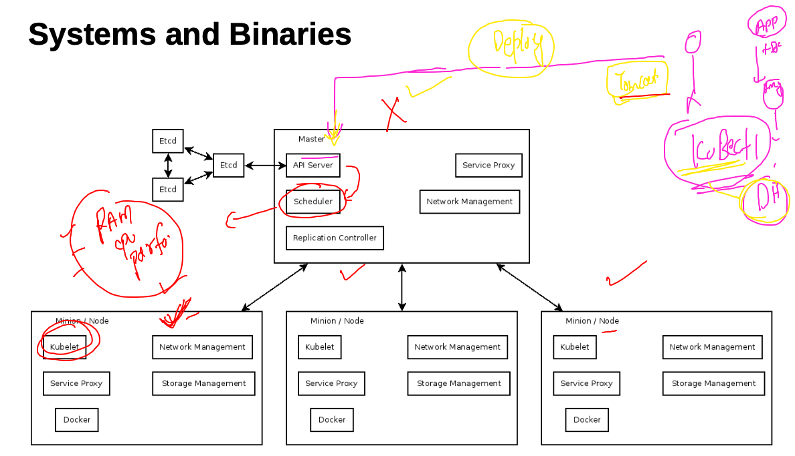


## etcd in k8s 

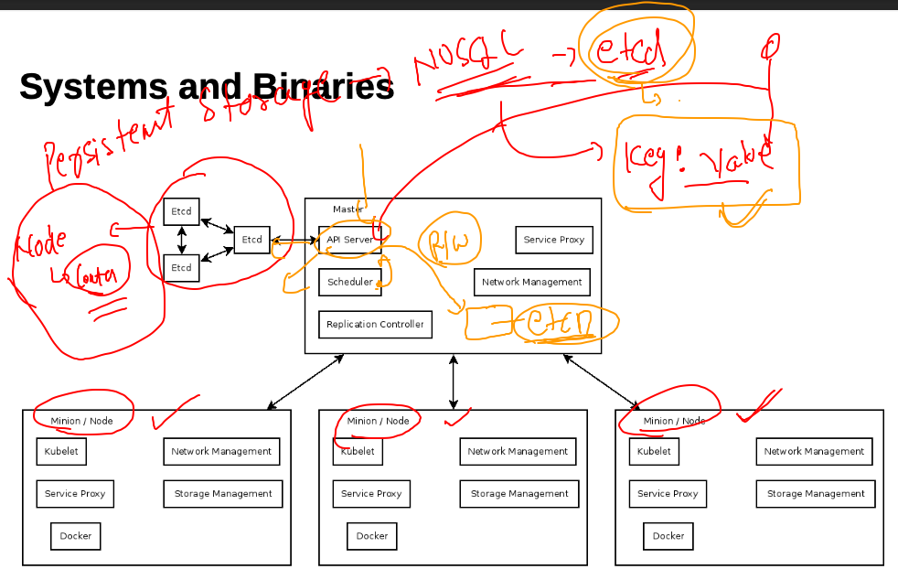

### container networking in k8s 

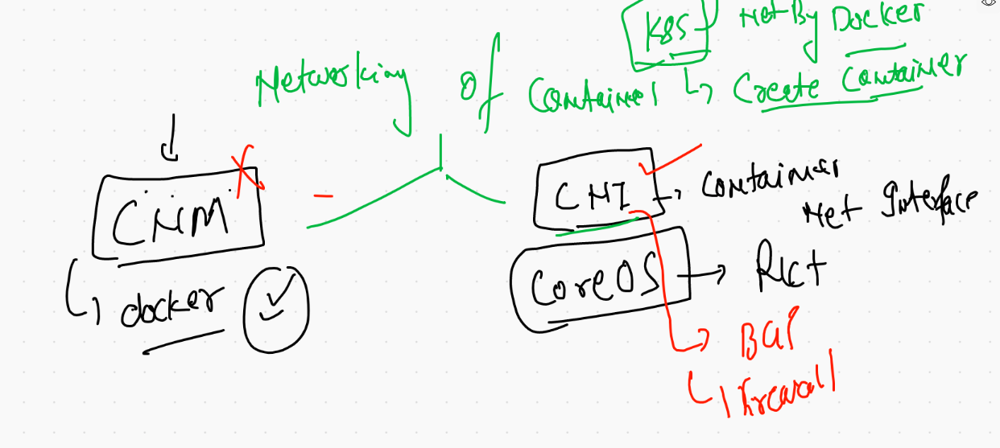


## CNI 

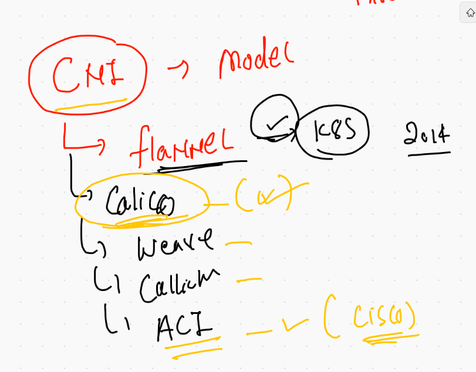

### cni based bridge accross the minion node 

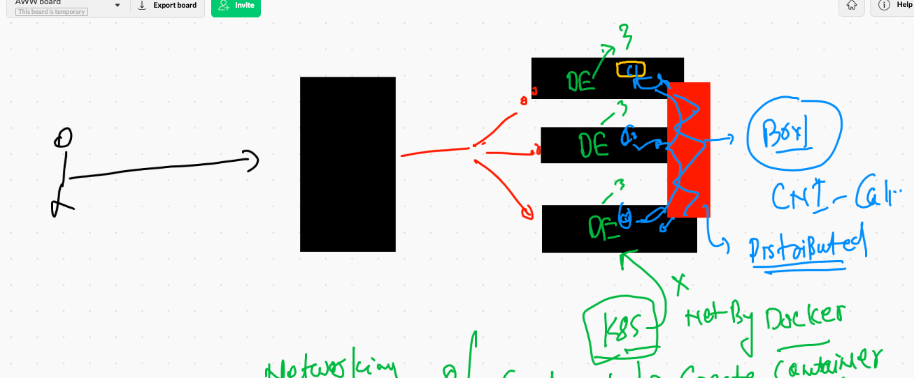


## docker  image -- DE -- container / docker image -- KE -- POD 

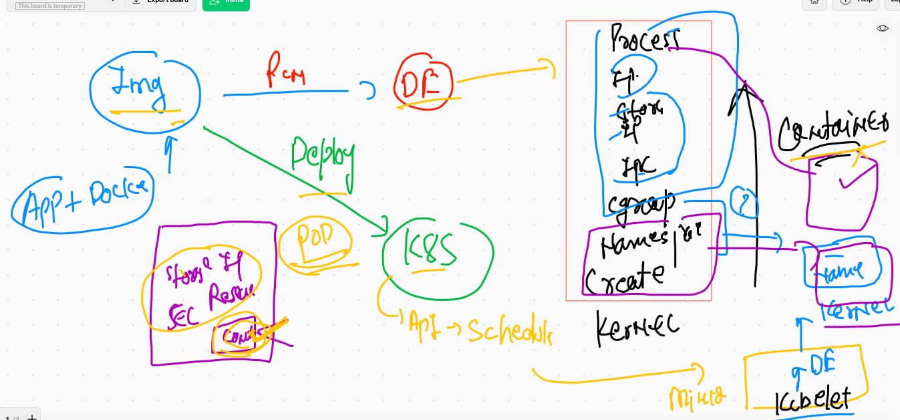

## a look to minion node 

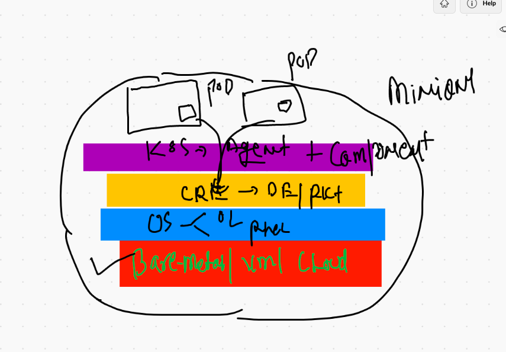

## Creating yaml for PODs

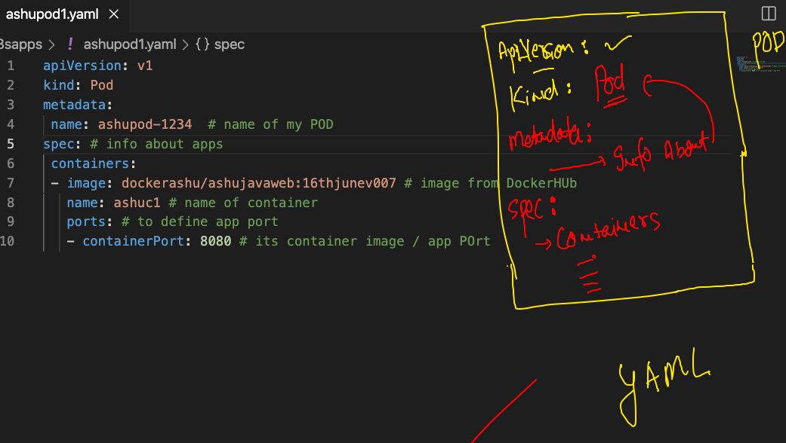

### checking syntax of yaml 

```
❯ ls
java       k8sapps    multistage python     webapp
❯ cd  k8sapps
❯ ls
ashupod1.yaml
❯ kubectl apply -f  ashupod1.yaml  --dry-run=client
pod/ashupod-1234 created (dry run)


```

### pod creation 

```
❯ kubectl apply -f  ashupod1.yaml
pod/ashupod-1234 created
❯ kubectl  get  pods
NAME           READY   STATUS              RESTARTS   AGE
ashupod-1234   0/1     ContainerCreating   0          8s

```

### pod deployment info 

```
 
❯ kubectl   get  pods  ashupod-1234    -o wide
NAME           READY   STATUS    RESTARTS   AGE     IP             NODE      NOMINATED NODE   READINESS GATES
ashupod-1234   1/1     Running   0          9m31s   192.168.34.3   minion1   <none>           <none>


```

###  getting pod 

```
❯ kubectl   get  pods     -o wide
NAME              READY   STATUS    RESTARTS   AGE     IP                NODE      NOMINATED NODE   READINESS GATES
amitpod-1234      1/1     Running   0          4m56s   192.168.34.12     minion1   <none>           <none>
anusha-123        1/1     Running   0          9m20s   192.168.34.6      minion1   <none>           <none>
ashupod-1234      1/1     Running   0          10m     192.168.34.3      minion1   <none>           <none>
chandrapod-1234   1/1     Running   0          5m58s   192.168.179.199   minion2   <none>           <none>
dhiraj123         1/1     Running   0          7m41s   192.168.34.9      minion1   <none>           <none>
inderpod-1234     1/1     Running   0          9m26s   192.168.34.5      minion1   <none>           <n

```

### describe pod 

```
❯ kubectl  describe  pod  ashupod-1234
Name:         ashupod-1234
Namespace:    default
Priority:     0
Node:         minion1/172.31.72.78
Start Time:   Thu, 17 Jun 2021 12:20:00 +0530
Labels:       <none>
Annotations:  cni.projectcalico.org/podIP: 192.168.34.3/32
              cni.projectcalico.org/podIPs: 192.168.34.3/32
Status:       Running
IP:           192.168.34.3
IPs:
  IP:  192.168.34.3
Containers:
  ashuc1:
    Container ID:   docker://db48a422b34a100f8b9b4df19e040d666887a31da6e14958468a81f1e6f7a7a0
    Image:          dockerashu/ashujavaweb:16thjunev007
    Image ID:       docker-pullable://dockerashu/ashujavaweb@sha256:4d593d91895beb8f8230751ccd8f7ef2983ac7c5fb20f174553b5263a290806c
    Port:           8080/TCP
    Host Port:      0/TCP

```

### access container of a pod

```
❯ kubectl   exec -it   ashupod-1234  -- bash
root@ashupod-1234:/usr/local/tomcat# ls
BUILDING.txt	 LICENSE  README.md	 RUNNING.txt  conf  logs	    temp     webapps.dist
CONTRIBUTING.md  NOTICE   RELEASE-NOTES  bin	      lib   native-jni-lib  webapps  work
root@ashupod-1234:/usr/local/tomcat# cd  webapps
root@ashupod-1234:/usr/local/tomcat/webapps# ls
WebApp	WebApp.war
root@ashupod-1234:/usr/local/tomcat/webapps# exit
exit


```

### deleting pod 

```
❯ kubectl  delete  pod  ashupod-1234
pod "ashupod-1234" deleted
❯ kubectl  get  po
NAME              READY   STATUS    RESTARTS   AGE
amitpod-1234      1/1     Running   0          12m
anusha-123        1/1     Running   0          17m
chandrapod-1234   1/1     Running   0          13m

```

### YAML and JSOn output generation 

```
❯ kubectl  run   ashupod2  --image=dockerashu/ashujavaweb:16thjunev007  --dry-run=client -o yaml
apiVersion: v1
kind: Pod
metadata:
  creationTimestamp: null
  labels:
    run: ashupod2
  name: ashupod2
spec:
  containers:
  - image: dockerashu/ashujavaweb:16thjunev007
    name: ashupod2
    resources: {}
  dnsPolicy: ClusterFirst
  restartPolicy: Always
status: {}
❯ kubectl  run   ashupod2  --image=dockerashu/ashujavaweb:16thjunev007  --dry-run=client -o json
{
    "kind": "Pod",
    "apiVersion": "v1",
    "metadata": {
        "name": "ashupod2",
        "creationTimestamp": null,
        "labels": {
            "run": "ashupod2"

```

### saving output to my file

```
❯ kubectl  run   ashupod2  --image=dockerashu/ashujavaweb:16thjunev007  --dry-run=client -o yaml  >autopod.yaml
❯ ls
ashupod1.yaml autopod.yaml
❯ kubectl  run   ashupod2  --image=dockerashu/ashujavaweb:16thjunev007  --dry-run=client -o json  >mypod.json
❯ ls
ashupod1.yaml autopod.yaml  mypod.json


```

### deleting pods 

```
❯ kubectl  delete  pods --all
pod "amitpod-1234" deleted
pod "amitpod2" deleted
pod "anusha-123" deleted
pod "chandrapod-new" deleted
pod "dhiraj123" deleted
pod "inderpod-1234" deleted
pod "isalipod-1234" deleted
pod "krishna-1711" deleted

```

### checking logs of pod 

```
 kubectl  logs  -f  ashualp 
 
```

## accessing application running in the POD 

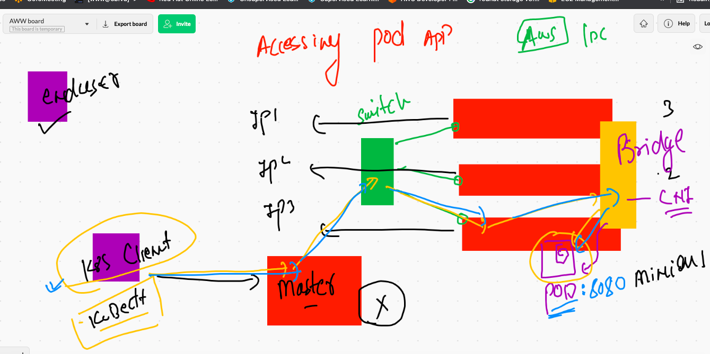

## Introduction to service 

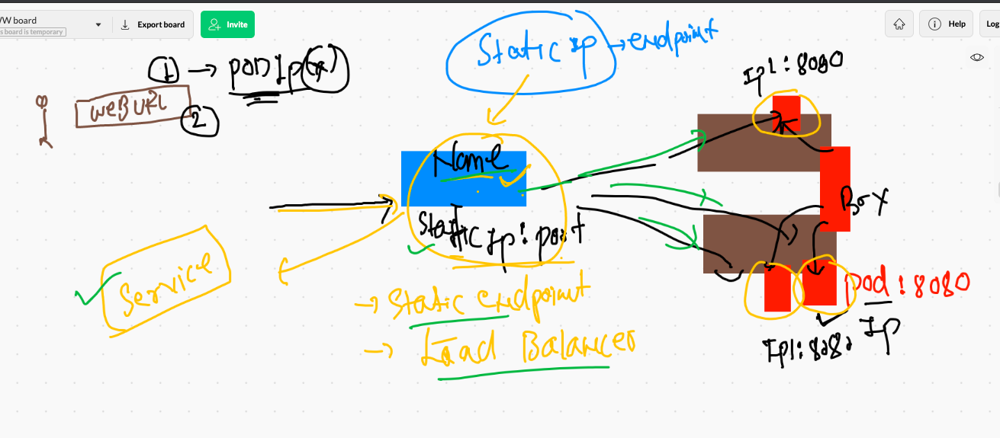

### service uses lable of pod to indentify 

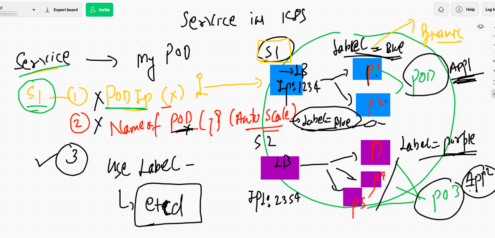

### type of services 

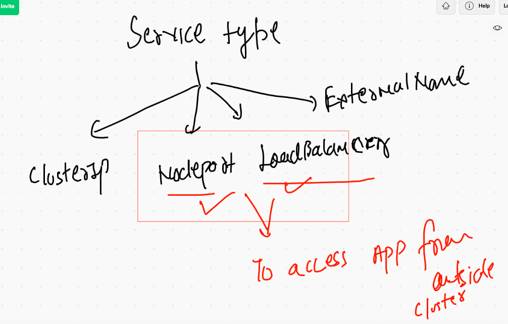

## checking label of pod 

```
❯ ls
alpine.yaml   ashupod1.yaml autopod.yaml  mypod.json    tomcat.yml
❯ kubectl  apply -f  tomcat.yml
pod/ashutomcat configured
❯ 
❯ kubectl  get  po ashutomcat --show-labels
NAME         READY   STATUS    RESTARTS   AGE   LABELS
ashutomcat   1/1     Running   0          62m   x=helloashuapp


```

### checking all pod labels 

```

❯ kubectl  get po   --show-labels
NAME            READY   STATUS        RESTARTS   AGE   LABELS
amitalp         1/1     Running       0          74m   run=amitalp
amittomcat      1/1     Running       0          65m   run=amittomcat,true=helloamitapp
anushapod3      1/1     Running       0          73m   run=anushapod3
anushatomcat    1/1     Running       0          57m   afternoon=kubesession
ashualp         1/1     Running       0          75m   run=ashualp
ashupod2        1/1     Running       0          85m   run=ashupod2

```

### creating service. 

```
kubectl  create  service   nodeport   ashusvc1   --tcp  1234:8080  --dry-run=client -o yaml >tomcatsvc.yaml
```

### Service Selector will use label of POD to find 

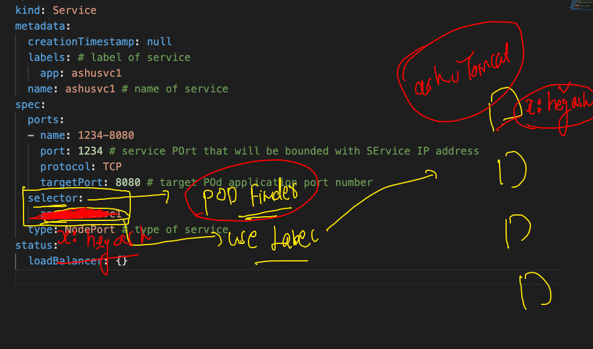

### creating service 

```
❯ kubectl  apply -f  tomcatsvc.yaml
service/ashusvc1 created
❯ kubectl  get  service
NAME             TYPE        CLUSTER-IP       EXTERNAL-IP   PORT(S)          AGE
amitsvc1         NodePort    10.99.199.12     <none>        9999:31937/TCP   13m
ashusvc1         NodePort    10.105.231.215   <none>        1234:31644/TCP   6s
chandrasvc       NodePort    10.104.170.106   <none>        1254:32673/TCP   2m46s
krishnaservice   NodePort    10.106.101.68    <none>        7777:31399/TCP   9m36s
kubernetes       ClusterIP   10.96.0.1        <none>        443/TCP          23h
navyasvc1        NodePort    10.108.232.158   <none>        1234:30850/TCP   60s

```

###  checking 

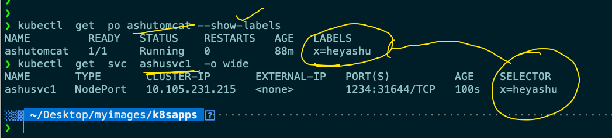

### Deleting all pods and services

```
❯ kubectl delete all --all
pod "amitalp" deleted
pod "amittomcat" deleted
pod "anushapod3" deleted
pod "anushatomcat" deleted
pod "ashualp" deleted


```

### namespace in k8s


```
❯ kubectl  get  pod  -n  kube-system
NAME                                       READY   STATUS    RESTARTS   AGE
calico-kube-controllers-78d6f96c7b-78t5h   1/1     Running   1          24h
calico-node-f96qn                          1/1     Running   1          24h
calico-node-lwjtg                          1/1     Running   1          24h
calico-node-z688k                          1/1     Running   1          24h
coredns-558bd4d5db-675lz                   1/1     Running   1          24h
coredns-558bd4d5db-pkb6n                   1/1     Running   1          24h
etcd-master-node                           1/1     Running   1          24h
kube-apiserver-master-node                 1/1     Running   1          24h
kube-controller-manager-master-node        1/1     Running   1          24h
kube-proxy-d7gjv                           1/1     Running   1          24h
kube-proxy-q89cb                           1/1     Running   1          24h
kube-proxy-x66q5                           1/1     Running   1          24h
kube-scheduler-master-node                 1/1     Running   1          24h

```

### creating namespaces 

```
❯ kubectl create  namespace   ashu-project
namespace/ashu-project created
❯ kubectl  get  ns
NAME              STATUS   AGE
anusha-project    Active   1s
ashu-project      Active   7s
default           Active   24h
kube-node-lease   Active   24h
kube-public       Active   24h
kube-system       Active   24h
vishal-project    Active   0s

```

### setting default namesapce 

```
❯ kubectl  config set-context --current  --namespace ashu-project
Context "kubernetes-admin@kubernetes" modified.
❯ 
❯ kubectl  get  po
No resources found in ashu-project namespace.
❯ 
❯ kubectl  config  get-contexts
CURRENT   NAME                          CLUSTER      AUTHINFO           NAMESPACE
*         kubernetes-admin@kubernetes   kubernetes   kubernetes-admin   ashu-project
          minikube                      minikube     minikube           default
          
 ```
 
 
  


