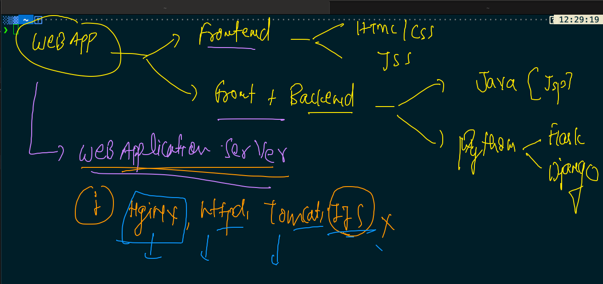
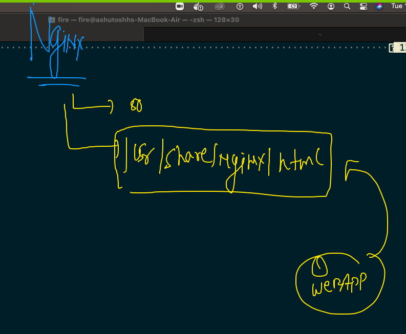

# Docker Day1 Revision 

## Docker CE a clean picture 


## ISolation between or among the contaienr is maintained by NameSpace in Docker 


## Cgroups to put limit in the Container 


## Demo of control groups 

### Memory limit 

```
 docker run -itd --name ashuc1   --memory 100M  alpine ping fb.com 
 
```

### CPu limit 

```
 docker run -itd --name ashuc2 --cpu-shares=20   --memory 100M  alpine ping fb.com 
 
```

## Image build process 


### Software installer in Operation system these days


### dockerfile for python sample code 


### building first image 


### 

```
❯ cd python
❯ ls
Dockerfile hello.py
❯ docker  build  -t   ashupython:v1  .
Sending build context to Docker daemon  3.584kB
Step 1/8 : FROM oraclelinux:8.3
 ---> 816d99f0bbe8
Step 2/8 : LABEL "author.name"="ashutoshh"
 ---> Running in 859843ffec95
Removing intermediate container 859843ffec95
 ---> 5bf46b3c927a
Step 3/8 : LABEL  "author.email"="ashutoshh@linux.com"
 ---> Running in 86f31f3c58e7
Removing intermediate container 86f31f3c58e7
 ---> 5e9d70dcb863
Step 4/8 : RUN dnf  install python3   -y

```


### creating container from the image 

```
❯ docker  run -itd  --name ashupyc1  ashupython:v1
5ec9588a48b8bfccffd1ff53194e25c3a1cd661f7ce7d02c290b8451965e2421
❯ docker  ps
CONTAINER ID   IMAGE           COMMAND              CREATED         STATUS         PORTS     NAMES
5ec9588a48b8   ashupython:v1   "python3 hello.py"   5 seconds ago   Up 2 seconds             ashupyc1

```

### checking output of default parent process

```
docker  logs  -f ashupyc1 

```

### accessing a running container as child process

```
❯ docker  exec -it  ashupyc1  bash
[root@5ec9588a48b8 code]# 
[root@5ec9588a48b8 code]# pwd
/code
[root@5ec9588a48b8 code]# ls
hello.py
[root@5ec9588a48b8 code]# exit
exit

```

### building image with another name dockerfile

```

❯ ls
Dockerfile        hello.py          python.dockerfile

░▒▓ ~/Desktop/myimages/python ······················································· 12:32:10 pm ▓▒░─╮
❯ docker  build  -t  ashupy:v2  -f  python.dockerfile .                                                ─╯


```

## webapp containerization process 



 ### Nginx based containerization 
 
 
 
 ### Nginx based image build 
 
 ```
 ❯ ls
Dockerfile   samplewebapp
❯ docker  build  -t   ashungweb:v1  .
Sending build context to Docker daemon  79.87kB
Step 1/3 : FROM nginx
 ---> d1a364dc548d
Step 2/3 : MAINTAINER ashutoshh@linux.com
 ---> Running in 8a22aafd13b3
Removing intermediate container 8a22aafd13b3
 ---> 7339e449c2c5
Step 3/3 : COPY samplewebapp  /usr/share/nginx/html/
 ---> 527a6e8f093a
Successfully built 527a6e8f093a
Successfully tagged ashungweb:v1

```


