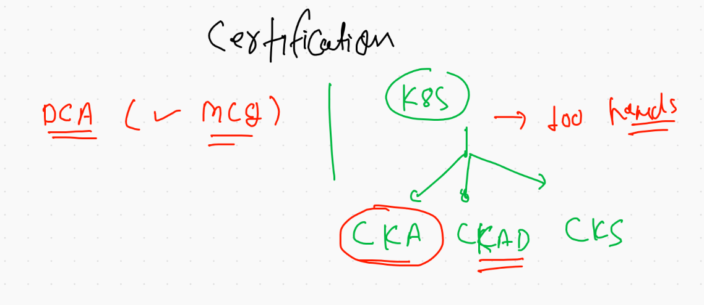
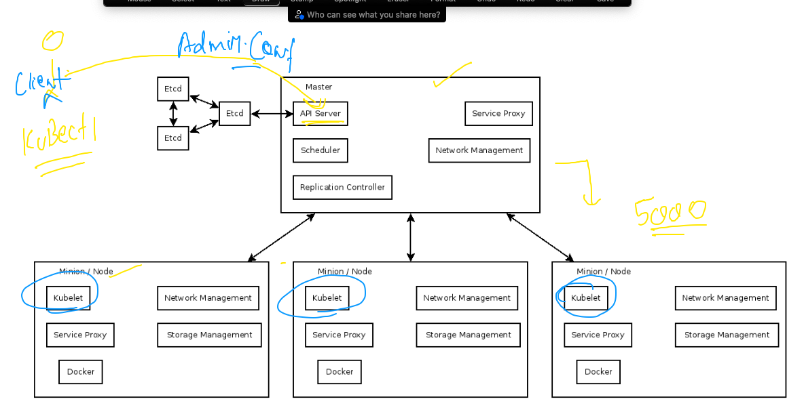
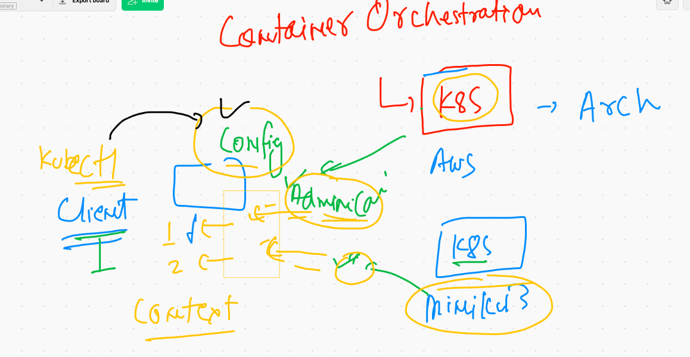
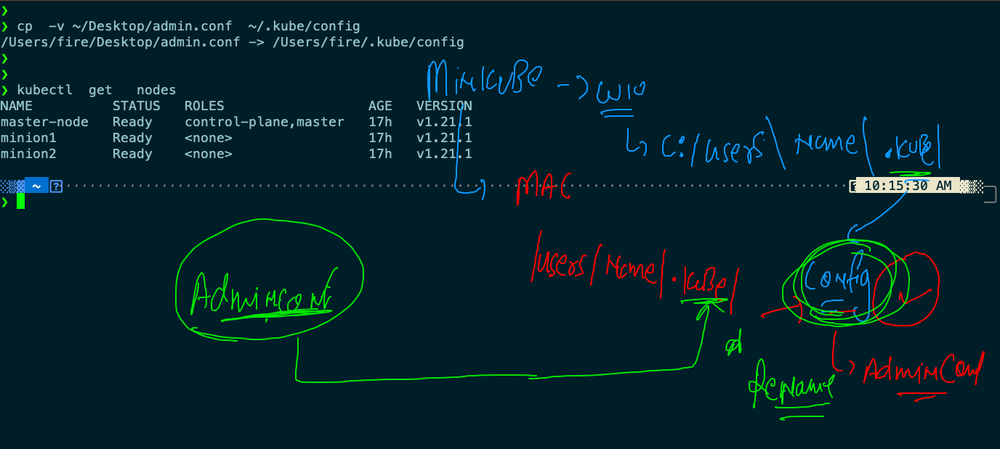

## Kubernetes and docker certifications info 



### k8s arch 



## kubeconfig file in client side 



## setting up config 



### history 

```
❯ kubectl  get   nodes
NAME          STATUS   ROLES                  AGE   VERSION
master-node   Ready    control-plane,master   17h   v1.21.1
minion1       Ready    <none>                 17h   v1.21.1
minion2       Ready    <none>                 17h   v1.21.1
❯ kubectl  version
Client Version: version.Info{Major:"1", Minor:"21", GitVersion:"v1.21.1", GitCommit:"5e58841cce77d4bc13713ad2b91fa0d961e69192", GitTreeState:"clean", BuildDate:"2021-05-12T14:18:45Z", GoVersion:"go1.16.4", Compiler:"gc", Platform:"darwin/amd64"}
Server Version: version.Info{Major:"1", Minor:"21", GitVersion:"v1.21.1", GitCommit:"5e58841cce77d4bc13713ad2b91fa0d961e69192", GitTreeState:"clean", BuildDate:"2021-05-12T14:12:29Z", GoVersion:"go1.16.4", Compiler:"gc", Platform:"linux/amd64"}
❯ kubectl cluster-info
Kubernetes control plane is running at https://54.242.142.161:6443
CoreDNS is running at https://54.242.142.161:6443/api/v1/namespaces/kube-system/services/kube-dns:dns/proxy

To further debug and diagnose cluster problems, use 'kubectl cluster-info dump'.


```


