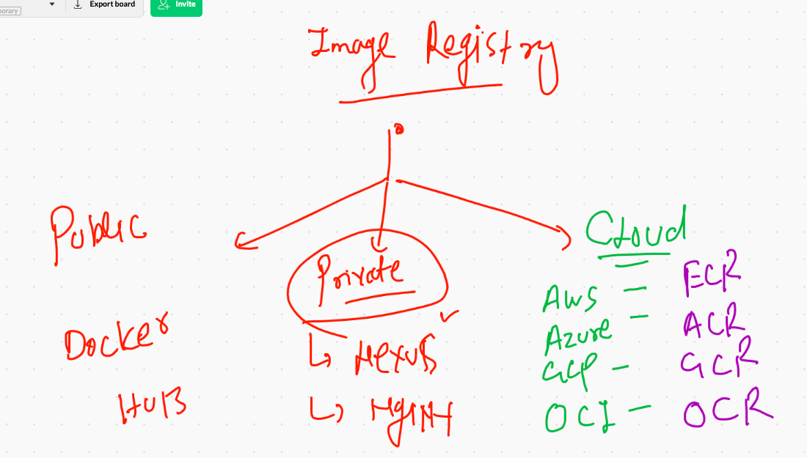
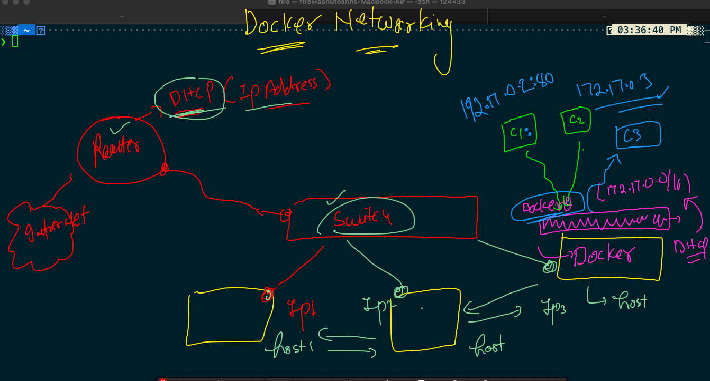
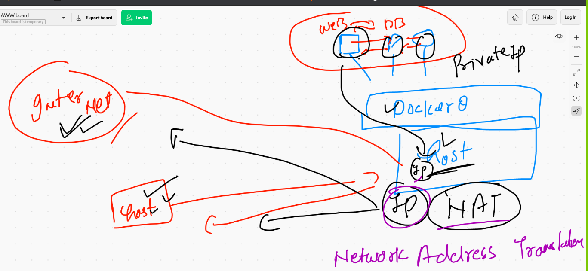
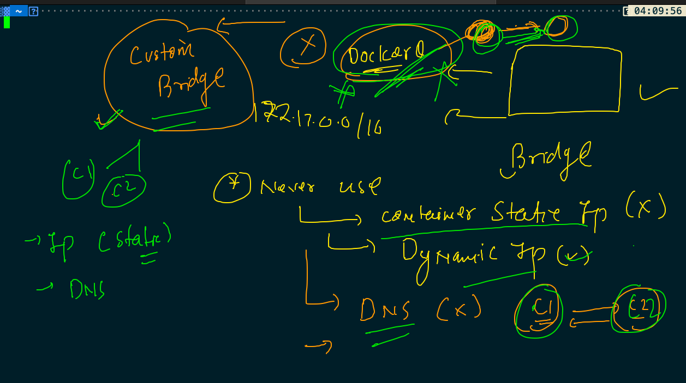
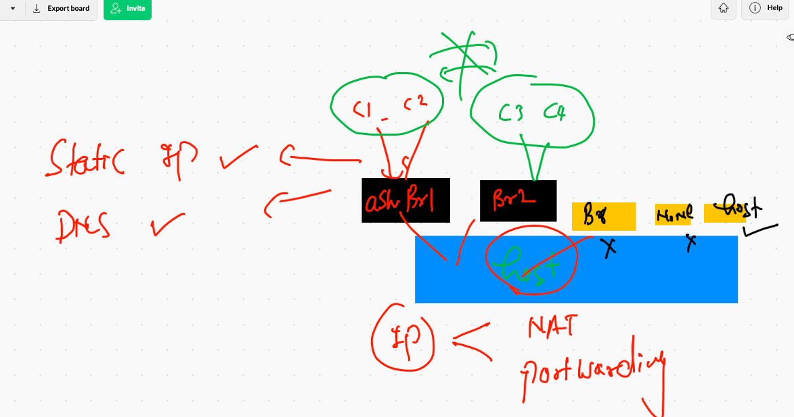

# Docker Day1 Revision 

## Docker CE a clean picture 


## ISolation between or among the contaienr is maintained by NameSpace in Docker 


## Cgroups to put limit in the Container 


## Demo of control groups 

### Memory limit 

```
 docker run -itd --name ashuc1   --memory 100M  alpine ping fb.com 
 
```

### CPu limit 

```
 docker run -itd --name ashuc2 --cpu-shares=20   --memory 100M  alpine ping fb.com 
 
```

## Image build process 


### Software installer in Operation system these days


### dockerfile for python sample code 


### building first image 


### 

```
❯ cd python
❯ ls
Dockerfile hello.py
❯ docker  build  -t   ashupython:v1  .
Sending build context to Docker daemon  3.584kB
Step 1/8 : FROM oraclelinux:8.3
 ---> 816d99f0bbe8
Step 2/8 : LABEL "author.name"="ashutoshh"
 ---> Running in 859843ffec95
Removing intermediate container 859843ffec95
 ---> 5bf46b3c927a
Step 3/8 : LABEL  "author.email"="ashutoshh@linux.com"
 ---> Running in 86f31f3c58e7
Removing intermediate container 86f31f3c58e7
 ---> 5e9d70dcb863
Step 4/8 : RUN dnf  install python3   -y

```


### creating container from the image 

```
❯ docker  run -itd  --name ashupyc1  ashupython:v1
5ec9588a48b8bfccffd1ff53194e25c3a1cd661f7ce7d02c290b8451965e2421
❯ docker  ps
CONTAINER ID   IMAGE           COMMAND              CREATED         STATUS         PORTS     NAMES
5ec9588a48b8   ashupython:v1   "python3 hello.py"   5 seconds ago   Up 2 seconds             ashupyc1

```

### checking output of default parent process

```
docker  logs  -f ashupyc1 

```

### accessing a running container as child process

```
❯ docker  exec -it  ashupyc1  bash
[root@5ec9588a48b8 code]# 
[root@5ec9588a48b8 code]# pwd
/code
[root@5ec9588a48b8 code]# ls
hello.py
[root@5ec9588a48b8 code]# exit
exit

```

### building image with another name dockerfile

```

❯ ls
Dockerfile        hello.py          python.dockerfile

░▒▓ ~/Desktop/myimages/python ······················································· 12:32:10 pm ▓▒░─╮
❯ docker  build  -t  ashupy:v2  -f  python.dockerfile .                                                ─╯


```

## webapp containerization process 


 ### Nginx based containerization 
 
 
 
 ### Nginx based image build 
 
 ```
 ❯ ls
Dockerfile   samplewebapp
❯ docker  build  -t   ashungweb:v1  .
Sending build context to Docker daemon  79.87kB
Step 1/3 : FROM nginx
 ---> d1a364dc548d
Step 2/3 : MAINTAINER ashutoshh@linux.com
 ---> Running in 8a22aafd13b3
Removing intermediate container 8a22aafd13b3
 ---> 7339e449c2c5
Step 3/3 : COPY samplewebapp  /usr/share/nginx/html/
 ---> 527a6e8f093a
Successfully built 527a6e8f093a
Successfully tagged ashungweb:v1

```

## Docker image registry 



### pushing image on Docker hub 

```
❯ docker  tag  ashungweb:v1   dockerashu/ashungweb:v1
❯ docker login
Login with your Docker ID to push and pull images from Docker Hub. If you don't have a Docker ID, head over to https://hub.docker.com to create one.
Username: dockerashu
Password: 
Login Succeeded
❯ docker push dockerashu/ashungweb:v1
The push refers to repository [docker.io/dockerashu/ashungweb]
b5f2f1510bc5: Pushed 
075508cf8f04: Mounted from library/nginx 
5c865c78bc96: Mounted from library/nginx 
134e19b2fac5: Mounted from library/nginx 
83634f76e732: Mounted from library/nginx 
766fe2c3fc08: Mounted from library/nginx 
02c055ef67f5: Mounted from library/nginx 
v1: digest: sha256:224968be16e18196282fbf3d4ecb69f2282f6d8f1d8613c0aadead2fcc0ea990 size: 1779
❯ docker logout
Removing login credentials for https://index.docker.io/v1/

```

### Pushing image to docker hub 

```

10130  docker  tag  ashungweb:v1   dockerashu/ashungweb:v1 
10131  docker login  
10132  docker push dockerashu/ashungweb:v1 
10133  docker logout 

```

## DOcker Networking 



### container internals

```
❯ docker  inspect  ashuc1
[
    {
        "Id": "95d358dd2bb87f53f88a1c836920c1106eb8e112ef28076dfdfc4ba856788b4c",
        "Created": "2021-06-15T10:17:32.29340381Z",
        "Path": "ping",
        "Args": [
            "fb.com"
        ],
        "State": {
            "Status": "running",
            "Running": true,
            "Paused": false,
            "Restarting": false,
            "OOMKilled": false,
            "Dead": false,
            "Pid": 25908,


 "Networks": {
                "bridge": {
                    "IPAMConfig": null,
                    "Links": null,
                    "Aliases": null,
                    "NetworkID": "eabdd3d59bcb71ddd1081d9edcf880ec5a9d249cb5cf8856c7bc85c075e18189",
                    "EndpointID": "fb40d44161e266d3699e90c0d809087211c4f49b3973448355bbe967c206ca9c",
                    "Gateway": "172.17.0.1",
                    "IPAddress": "172.17.0.2",
                    "IPPrefixLen": 16,
                    "IPv6Gateway": "",
                    "GlobalIPv6Address": "",
                    "GlobalIPv6PrefixLen": 0,
                    "MacAddress": "02:42:ac:11:00:02",
                    "DriverOpts": null
                }


```

### Inspect with Docker Formating 

```
10162  docker inspect  ashuc1  --format='{{.Id}}'
10163  docker inspect  ashuc1  --format='{{.State.Status}}'
10164  docker inspect  ashuc1  --format='{{.NetworkSettings.IPAddress}}'
10165  docker ps
10166  docker inspect  krishnac1  --format='{{.NetworkSettings.IPAddress}}'

```

### checking ipaddress of container 

```
❯ docker  exec -it  ashuc1  sh
/ # ifconfig 
eth0      Link encap:Ethernet  HWaddr 02:42:AC:11:00:02  
          inet addr:172.17.0.2  Bcast:172.17.255.255  Mask:255.255.0.0
          UP BROADCAST RUNNING MULTICAST  MTU:1500  Metric:1
          RX packets:799 errors:0 dropped:0 overruns:0 frame:0
          TX packets:778 errors:0 dropped:0 overruns:0 carrier:0
          collisions:0 txqueuelen:0 
          RX bytes:75478 (73.7 KiB)  TX bytes:73996 (72.2 KiB)

lo        Link encap:Local Loopback  
          inet addr:127.0.0.1  Mask:255.0.0.0
          UP LOOPBACK RUNNING  MTU:65536  Metric:1
          RX packets:0 errors:0 dropped:0 overruns:0 frame:0
          TX packets:0 errors:0 dropped:0 overruns:0 carrier:0
          collisions:0 txqueuelen:1000 
          RX bytes:0 (0.0 B)  TX bytes:0 (0.0 B)

/ # exit

```

### COntainers can go outside using Host IP 

### NAT 



### Introduction  to custom bridges 



## checking bridges 

```
❯ docker  network   ls
NETWORK ID     NAME      DRIVER    SCOPE
eabdd3d59bcb   bridge    bridge    local
bb23cdb65a9a   host      host      local
72072b4a0c09   none      null      local
❯ docker  network  inspect  eabdd3d59bcb
[
    {
        "Name": "bridge",
        "Id": "eabdd3d59bcb71ddd1081d9edcf880ec5a9d249cb5cf8856c7bc85c075e18189",
        "Created": "2021-06-14T09:28:03.868769229Z",
        "Scope": "local",
        "Driver": "bridge",
        "EnableIPv6": false,
        "IPAM": {
            "Driver": "default",
            "Options": null,
            "Config": [
                {
                    "Subnet": "172.17.0.0/16"
                }
            ]

```

### COntainer with No networking 

```
❯ docker  network   ls
NETWORK ID     NAME      DRIVER    SCOPE
eabdd3d59bcb   bridge    bridge    local
bb23cdb65a9a   host      host      local
72072b4a0c09   none      null      local
❯ docker  run  -it   --name x1 --network  none  alpine  sh
/ # ifconfig 
lo        Link encap:Local Loopback  
          inet addr:127.0.0.1  Mask:255.0.0.0
          UP LOOPBACK RUNNING  MTU:65536  Metric:1
          RX packets:0 errors:0 dropped:0 overruns:0 frame:0
          TX packets:0 errors:0 dropped:0 overruns:0 carrier:0
          collisions:0 txqueuelen:1000 
          RX bytes:0 (0.0 B)  TX bytes:0 (0.0 B)

/ # ping 172.17.0.1
PING 172.17.0.1 (172.17.0.1): 56 data bytes
ping: sendto: Network unreachable
/ # ping google.com 
ping: bad address 'google.com'
/ # ^C
/ # 
❯ docker  rm  x1
x1


```

### Container with Host bridge 

```
❯ docker  run  -it   --name x1 --network host   alpine  sh
/ # ifconfig 
docker0   Link encap:Ethernet  HWaddr 02:42:48:A6:7F:1D  
          inet addr:172.17.0.1  Bcast:172.17.255.255  Mask:255.255.0.0
          inet6 addr: fe80::42:48ff:fea6:7f1d/64 Scope:Link
          UP BROADCAST MULTICAST  MTU:1500  Metric:1
          RX packets:12294938 errors:0 dropped:0 overruns:0 frame:0
          TX packets:1207409 errors:0 dropped:0 overruns:0 carrier:0
          collisions:0 txqueuelen:0 
          RX bytes:591104400 (563.7 MiB)  TX bytes:1441457527 (1.3 GiB)

eth0      Link encap:Ethernet  HWaddr 12:92:52:67:F9:DF  
          inet addr:172.31.93.225  Bcast:172.31.95.255  Mask:255.255.240.0
          inet6 addr: fe80::1092:52ff:fe67:f9df/64 Scope:Link
          UP BROADCAST RUNNING MULTICAST  MTU:9001  Metric:1
          RX packets:8456979 errors:0 dropped:0 overruns:0 frame:0
          TX packets:14263557 errors:0 dropped:0 overruns:0 carrier:0
          collisions:0 txqueuelen:1000 
          RX bytes:11015301717 (10.2 GiB)  TX bytes:1239421338 (1.1 GiB)

lo        Link encap:Local Loopback  
          inet addr:127.0.0.1  Mask:255.0.0.0
          inet6 addr: ::1/128 Scope:Host
          UP LOOPBACK RUNNING  MTU:65536  Metric:1
          RX packets:3352 errors:0 dropped:0 overruns:0 frame:0
          TX packets:3352 errors:0 dropped:0 overruns:0 carrier:0
          collisions:0 txqueuelen:1000 
          RX bytes:187664 (183.2 KiB)  TX bytes:187664 (183.2 KiB)

/ # 


```

### Custom bridge creation 



## creating bridge 

```
0187  docker  network   create   ashubr1   
10188  docker  network   create   ashubr2  --subnet  192.168.10.0/24  
10189  docker  network  ls


```

### creating container in custom bridge

```
❯ docker  run -itd --name ashubr1c1  --network ashubr1  alpine ping fb.com
5bb729658f6ab0fb0adf7f669e9a5dfc5d54e94efb325b8a5983f7b18cd59d2e
❯ 
❯ docker  run -itd --name ashubr1c2  --network ashubr1  alpine ping fb.com
2ff744a0348476372b878dc55e8b89d2abbd7ab2fe735d222a7809ce5d899c5d
❯ docker  network  inspect  ashubr1
[
    {
        "Name": "ashubr1",
        "Id": "3b0a8c6693a5ed6a426c41345c68a4bb6b50a2122367e74dfba9a2d5930c8d84",
        "Created": "2021-06-15T11:30:18.17931784Z",
        "Scope": "local",
        "Driver": "bridge",
        "EnableIPv6": false,
        "IPAM": {
            "Driver": "default",
            "Options": {},
            "Config": [
                {
                    "Subnet": "172.18.0.0/16",
                    "Gateway": "172.18.0.1"
                }
            ]
        },
        "Internal": false,
        "Attachable": false,
        "Ingress": false,
        "ConfigFrom": {
            "Network": ""
        },
        "ConfigOnly": false,
        "Containers": {
            "2ff744a0348476372b878dc55e8b89d2abbd7ab2fe735d222a7809ce5d899c5d": {
                "Name": "ashubr1c2",
                "EndpointID": "d655cee47e40973311714bdecd09b0c1b48df1493dd17351abe9ea9499eb94d8",
                "MacAddress": "02:42:ac:12:00:03",
                "IPv4Address": "172.18.0.3/16",
                "IPv6Address": ""
            },
            "5bb729658f6ab0fb0adf7f669e9a5dfc5d54e94efb325b8a5983f7b18cd59d2e": {
                "Name": "ashubr1c1",
                "EndpointID": "00b0a1dc701bde5585bb222f4dc74c5b0aae18d169567c8e3c5fff2e6016600c",
                "MacAddress": "02:42:ac:12:00:02",
                "IPv4Address": "172.18.0.2/16",
                "IPv6Address": ""
            }
        },
        "Options": {},
        "Labels": {}
    }
]


```

### container 1 to container 2

```
❯ docker  exec -it  ashubr1c1 sh
/ # ping ashubr1c2
PING ashubr1c2 (172.18.0.3): 56 data bytes
64 bytes from 172.18.0.3: seq=0 ttl=255 time=0.107 ms
64 bytes from 172.18.0.3: seq=1 ttl=255 time=0.105 ms
64 bytes from 172.18.0.3: seq=2 ttl=255 time=0.107 ms
^C
--- ashubr1c2 ping statistics ---
3 packets transmitted, 3 packets received, 0% packet loss
round-trip min/avg/max = 0.105/0.106/0.107 ms
/ # exit


```

## day2 history 

```
10004  docker  run -itd --name  ashuc1  alpine  ksdjflksdjfsdfsdfl 
10005  docker  ps  -a
10006  docker rm  -f 2372aba59550 
10007  docker context  ls
10008  docker  images
10009  docker  ps
10010  docker rmi 81bcf752ac3d 7e0aa2d69a15 
10011  docker images
10012  history
10013  docker version 
10014  history
10015  docker  context ls
10016  docker  context  rm  new 
10017  docker  context  rm   myawsDE 
10018  docker  context ls
10019  history
10020  docker  context ls
10021  history
10022  docker  ps 
10023  docker rm $(docker ps -aq) -f
10024  docker run -itd --name ashuc1   --memory 100M  alpine ping fb.com 
10025  docker  ps
10026  docker  stats
10027  docker run -itd --name ashuc2 --cpus-share=20   --memory 100M  alpine ping fb.com 
10028  docker run -itd --name ashuc2 --cpu-shares=20   --memory 100M  alpine ping fb.com 
10029  docker stats
10030  history
10031  pip3 install  --user  docker 
10032  pip  install  --user  docker 
10033  pip3
10034  ssh  fire@192.168.1.12
10035  docker context ls
10036  ls
10037  cd python
10038  ls
10039  docker  build  -t   ashupython:v1  .  
10040  ls
10041  cd  python
10042  ls
10043  history
10044  docker  images
10045  hisotr
10046  history
10047  docker  images
10048  clear
10049  docker  images
10050  docker  run -itd  --name ashupyc1  ashupython:v1  
10051  docker  ps
10052  history
10053  docker  ps
10054  docker  logs  -f ashupyc1 
10055  history
10056  docker  ps
10057  docker  exec -it  ashupyc1  bash 
10058  history
10059  docker  ps
10060  docker  images
10061  history
10062  docker  ps
10063  docker  images
10064  docker run -it --rm  0966fa3c9274   bash 
10065  history
10066  docker  exec -it  ashupyc1  bash  
10067  docker run -tid --name webui -p 9000:9000  -v /var/run/docker.sock:/var/run/docker.sock --restart always portainer/portainer 
10068  docker  ps
10069  docker context ls
10070  history
10071  ls
10072  cd python
10073  ls
10074  docker  build  -t  ashupy:v2  -f  python.dockerfile  . 
10075  docker images
10076  history
10077  ls
10078  docker  build  -t  ashupy:v2  -f  python.dockerfile  python  
10079  docker  build  -t  ashupy:v2  -f  python.dockerfile  ./python 
10080  docker  build  -t  ashupy:v2  -f  python.dockerfile  /Users/fire/Desktop/myimages/python 
10081  docker  build  -t  ashupy:v2  -f  python.dockerfile  /Users/fire/Desktop/myimages/python/  
10082  ls
10083  cd python
10084  ls
10085  cd  Desktop
10086  ls
10087  cd  myimages
10088  ls
10089  cd  webapp
10090  ls
10091  git clone https://github.com/mdn/beginner-html-site-styled.git 
10092  docker  run -itd --name xx11 nginx 
10093  docker  exec -it xx11 bash 
10094  docker rm  xx11
10095  docker rm  xx11 -f
10096  cd
10097  cd  Desktop
10098  ls
10099  cd  myimages
10100  ls
10101  cd  webapp
10102  ls
10103  cd  webapp
10104  ls
10105  docker  build  -t   ashungweb:v1  . 
10106  cd  webapp
10107  docker  build  -t   ashungweb:v1  . 
10108  cd
10109  docker  build  -t x1:v1  /Users/fire/Desktop/myimages/webapp  
10110  cd  Desktop/myimages
10111  ls
10112  cd  python
10113  ls
10114  history
10115  ls
10116  cd
10117  docker  images
10118  docker  run -itd --name ashuwebc1  -p  1234:80  ashungweb:v1  
10119  docker  ps
10120  history
10121  docker context  ls
10122  docker  ps
10123  history
10124  docker context  ls
10125  docker  info 
10126  docker rm $(docker ps -aq) -f
10127  docker images
10128  docker  ps
10129  docker  images 
10130  docker  tag  ashungweb:v1   dockerashu/ashungweb:v1 
10131  docker login  
10132  docker push dockerashu/ashungweb:v1 
10133  docker logout 
10134  history
10135  docker  images
10136* history
10137* docker  context use default 
10138* docker images 
10139* docker rm $(docker ps -aq) 
10140* docker rmi $(docker images -q) -f
10141* history
10142* docker context  ls
10143* docker  images
10144* docker pull dockerashu/ashungweb:v1 
10145* docker  images
10146* docker  context use new1
10147* history
10148* docker  ps 
10149* docker  ps  -q
10150* docker  ps  
10151* docker  ps  -aq
10152* docker  rm  $(docker  ps  -aq) -f
10153* docker run -itd --name ashuc1 alpine ping fb.com 
10154* docker ps
10155* history
10156* docker  ps
10157* docker  inspect  ashuc1 
10158* docker  ps
10159* docker  inspect amitnet1  |   grep -i macad
10160* history
10161* docker  inspect  ashuc1 
10162  docker inspect  ashuc1  --format='{{.Id}}'
10163  docker inspect  ashuc1  --format='{{.State.Status}}'
10164  docker inspect  ashuc1  --format='{{.NetworkSettings.IPAddress}}'
10165  docker ps
10166  docker inspect  krishnac1  --format='{{.NetworkSettings.IPAddress}}'
10167  history
10168  docker  exec -it  ashuc1  sh 
10169  history
10170  docker  network   ls
10171  docker  network  inspect  eabdd3d59bcb  
10172  history
10173  docker  network   ls
10174  docker  network  inspect  eabdd3d59bcb  
10175  history
10176  docker  network   ls
10177  docker  rm $(docker ps -aq) -f
10178  docker  network  inspect  bridge
10179  history
10180  docker  network   ls
10181  docker  run  -it   --name x1 --network  none  alpine  sh  
10182  docker  rm  x1 
10183  docker  run  -it   --name x1 --network host   alpine  sh  
10184  docker  rm  x1 
10185  history
10186  docker  network  ls
10187  docker  network   create   ashubr1   
10188  docker  network   create   ashubr2  --subnet  192.168.10.0/24  
10189  docker  network  ls
10190  docker  network   inspect  ashubr1
10191  docker  network   inspect  ashubr2
10192  history
10193  docker  network  ls
10194  docker  run -itd --name ashubr1c1  --network ashubr1  alping ping fb.com 
10195  docker  run -itd --name ashubr1c1  --network ashubr1  alpine ping fb.com 
10196  docker  run -itd --name ashubr1c2  --network ashubr1  alpine ping fb.com 
10197  docker  network  inspect  ashubr1 
10198  history
10199  docker  exec -it  ahubr1c1 sh 
10200  docker  exec -it  ashubr1c1 sh 
```


