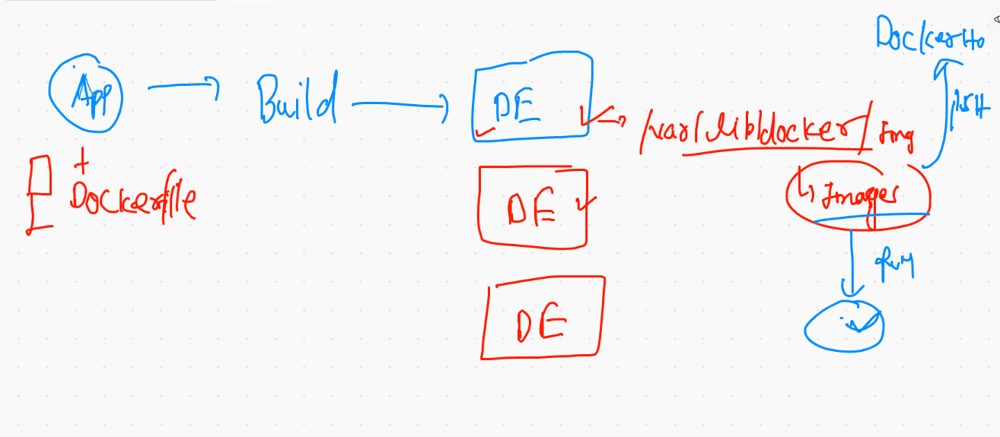
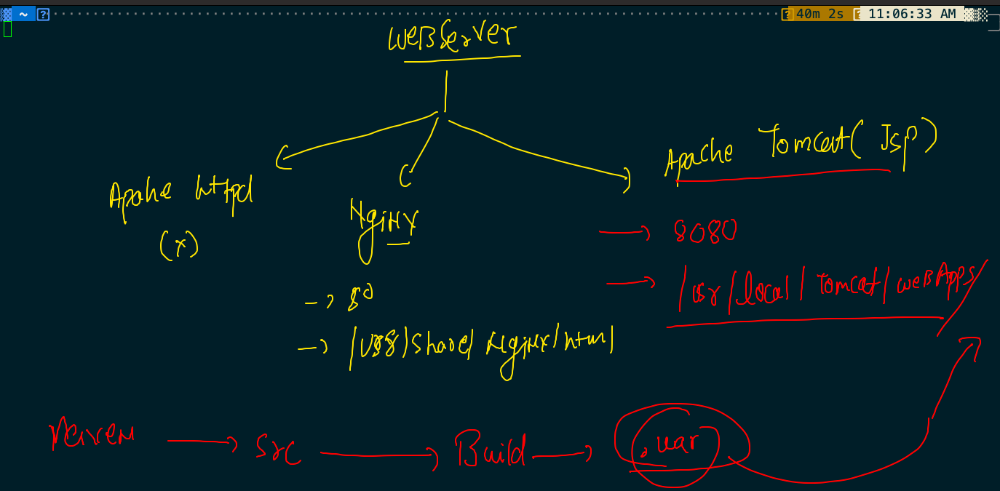
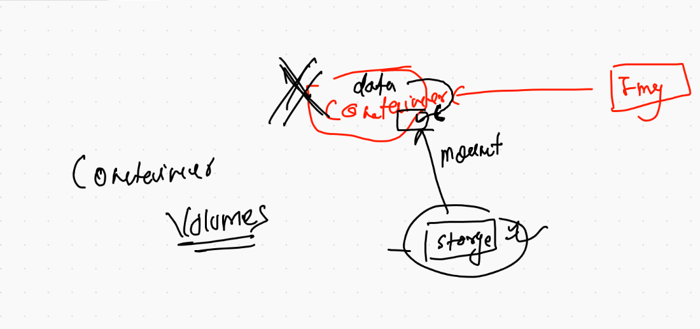
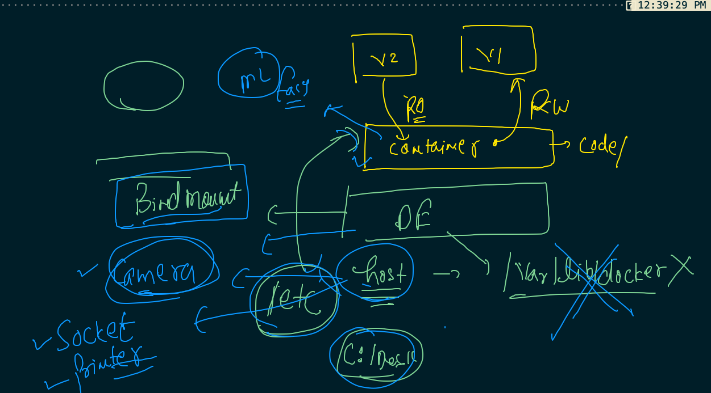

# Docker Revision 

### Docker engine history 



## tips to remove all unused network 

```
❯ docker network prune
WARNING! This will remove all custom networks not used by at least one container.
Are you sure you want to continue? [y/N] y
Deleted Networks:
navyabridge2
dhiraj12
ashubr2
isali3
krishbr1
vishal
tanmaybr1
ashubr1
navyabridge
gunjanbr
rockstar
tanmaybr2
vishalraina
isali2
krishbr2
gunjanbr1

❯ docker network  ls
NETWORK ID     NAME      DRIVER    SCOPE
ad517b7e7031   bridge    bridge    local
bb23cdb65a9a   host      host      local
72072b4a0c09   none      null      local

```

## MUlti stage dockerfile. -- javaweb app -- maven -to tomcat 

### info about tomcat 



### building image

```
❯ ls
Dockerfile README.md  pom.xml    src
❯ docker  build  -t  dockerashu/ashujavaweb:16thjunev007  .
Sending build context to Docker daemon  36.86kB
Step 1/17 : FROM oraclelinux:8.3 as JavaBuild
 ---> 816d99f0bbe8
Step 2/17 : label "author.name"="ashutoshh"
 ---> Using cache
 ---> 5bf46b3c927a
Step 3/17 : LABEL  "author.email"="ashutoshh@linux.com"
 ---> Using cache
 ---> 5e9d70dcb863
Step 4/17 : RUN dnf install java-1.8.0-openjdk.x86_64 -y
 ---> Using cache
 ---> 6998a9e7f9d7
Step 5/17 : RUN dnf  install maven -y


```

### creating container 

```
 docker  run -tid --name ashuweb1  -p 1234:8080  dockerashu/ashujavaweb:16thjunev007
5a0156d9cce3d29d21e157c9c89e6eabf3396a8b39694c3de74ebbe8ee78ddb9
❯ docker  ps
CONTAINER ID   IMAGE                                 COMMAND                  CREATED          STATUS          PORTS                    NAMES
5a0156d9cce3   dockerashu/ashujavaweb:16thjunev007   "catalina.sh run"        6 seconds ago    Up 4 seconds    0.0.0.0:1234->8080/tcp   ashuweb1


```

## Docker volumes 



## creating volume 

```
❯ docker  volume  create  ashuvol1
ashuvol1
❯ docker  volume  ls
DRIVER    VOLUME NAME
local     0eebcd3bcb2f33a9f7e3f0177d6f7f5b8ba170ca039b317178ceafa44b11d9dc
local     ashuvol1

```

### volume explain 

```

❯ docker  volume  inspect  ashuvol1
[
    {
        "CreatedAt": "2021-06-16T06:43:40Z",
        "Driver": "local",
        "Labels": {},
        "Mountpoint": "/var/lib/docker/volumes/ashuvol1/_data",
        "Name": "ashuvol1",
        "Options": {},
        "Scope": "local"
    }
]

```


### volume mounts with different containers 

```
❯ docker  run -itd  --name ashuc111  -v  ashuvol1:/mydata:rw    alpine ping fb.com
67e577ebbabe78c4e03bdf24d9bf201a40bf8fd8f6516928730161bbdc4ca83c
❯ 
❯ 
❯ 
❯ docker  run -itd  --name ashuc222  -v  ashuvol1:/read:ro    alpine ping fb.com
c1c2d89cbfb802955b8a0cac1fcb0c101c0b535fb89a9a963a05536ff87ba8af
❯ docker  exec -it  ashuc111 sh
/ # cd  /mydata/
/mydata # ls
/mydata # echo hello world  >a.txt
/mydata # ls
a.txt
/mydata # 
❯ docker  exec -it  ashuc222  sh
/ # cd  /read/
/read # ls
a.txt
/read # cat  a.txt 
hello world
/read # rm  a.txt 
rm: remove 'a.txt'? y
rm: can't remove 'a.txt': Read-only file system
/read # 
/read # 
/read # exit

```

### container with multi volume 

```
10061  docker  volume  create  ashuvol1 
10062  docker  volume  ls
10063  docker  volume  inspect  ashuvol1 
10064  docker  volume  ls
10065  docker  run -itd  --name ashuc111  -v  ashuvol1:/mydata:rw    alpine ping fb.com 
10066  docker  run -itd  --name ashuc222  -v  ashuvol1:/read:ro    alpine ping fb.com 
10067  docker  exec -it  ashuc111 sh 
10068  docker  exec -it  ashuc222  sh 
10069  docker  rm   ashuc111 -f
10070  docker run -it --rm  -v  ashuvol1:/ok      oraclelinux:8.3  bash 
❯ docker run -it --rm  -v  ashuvol1:/ok  -v  ashuvol2:/new:ro      oraclelinux:8.3  bash
[root@78fd6db4e156 /]# 

```

### Bind Mount concept 



### demo1 

```
❯ docker run -it --rm   -v   /etc:/myetc:ro   alpine sh
/ # cd /myetc/
/myetc # ls
DIR_COLORS               depmod.d                 krb5.conf                pki                      setuptool.d
DIR_COLORS.256color      dhcp                     krb5.conf.d              plymouth                 shadow
DIR_COLORS.lightbgcolor  docker                   ld.so.cache              pm                       shadow-
GREP_COLORS              docker-runtimes.d        ld.so.conf               popt.d                   shells
GeoIP.conf               dracut.conf              ld.so.conf.d             postfix                  skel
GeoIP.conf.default       dr

```

### webui demo 

```
 docker run -itd  --name webui  -v  /var/run/docker.sock:/var/run/docker.sock  -p 9000:9000  portainer/portainer:latest 

```


