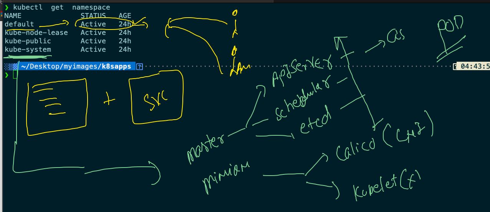
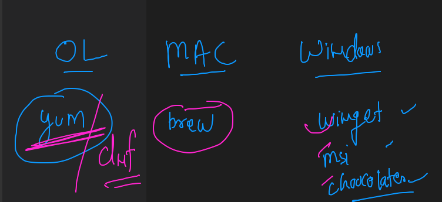
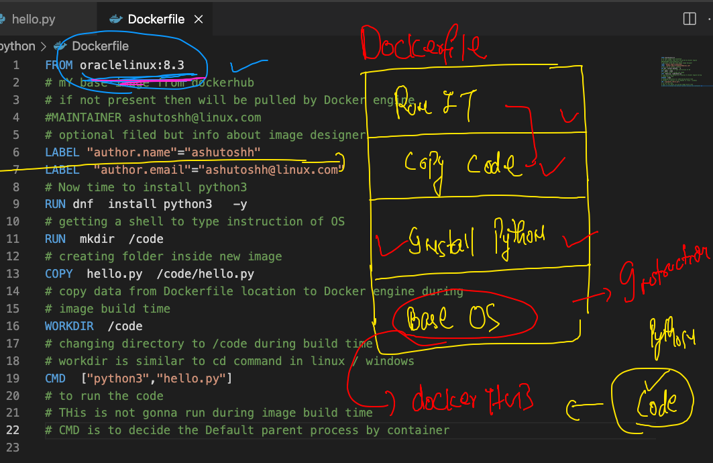
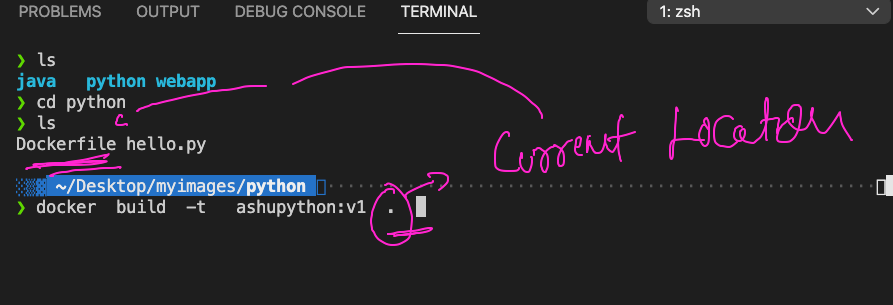

# Docker Day1 Revision 

## Docker CE a clean picture 


## ISolation between or among the contaienr is maintained by NameSpace in Docker 



## Cgroups to put limit in the Container 


## Demo of control groups 

### Memory limit 

```
 docker run -itd --name ashuc1   --memory 100M  alpine ping fb.com 
 
```

### CPu limit 

```
 docker run -itd --name ashuc2 --cpu-shares=20   --memory 100M  alpine ping fb.com 
 
```

## Image build process 


### Software installer in Operation system these days



### dockerfile for python sample code 



### building first image 



### 

```
❯ cd python
❯ ls
Dockerfile hello.py
❯ docker  build  -t   ashupython:v1  .
Sending build context to Docker daemon  3.584kB
Step 1/8 : FROM oraclelinux:8.3
 ---> 816d99f0bbe8
Step 2/8 : LABEL "author.name"="ashutoshh"
 ---> Running in 859843ffec95
Removing intermediate container 859843ffec95
 ---> 5bf46b3c927a
Step 3/8 : LABEL  "author.email"="ashutoshh@linux.com"
 ---> Running in 86f31f3c58e7
Removing intermediate container 86f31f3c58e7
 ---> 5e9d70dcb863
Step 4/8 : RUN dnf  install python3   -y

```


### creating container from the image 

```
❯ docker  run -itd  --name ashupyc1  ashupython:v1
5ec9588a48b8bfccffd1ff53194e25c3a1cd661f7ce7d02c290b8451965e2421
❯ docker  ps
CONTAINER ID   IMAGE           COMMAND              CREATED         STATUS         PORTS     NAMES
5ec9588a48b8   ashupython:v1   "python3 hello.py"   5 seconds ago   Up 2 seconds             ashupyc1

```

### checking output of default parent process

```
docker  logs  -f ashupyc1 

```

### accessing a running container as child process

```
❯ docker  exec -it  ashupyc1  bash
[root@5ec9588a48b8 code]# 
[root@5ec9588a48b8 code]# pwd
/code
[root@5ec9588a48b8 code]# ls
hello.py
[root@5ec9588a48b8 code]# exit
exit

```


