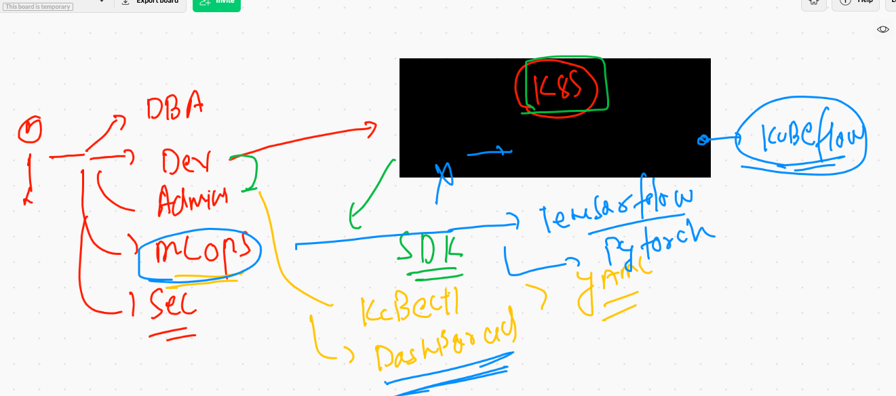
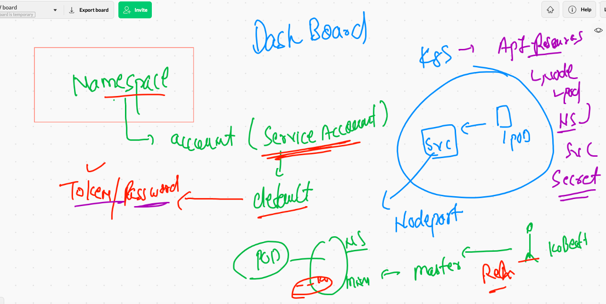
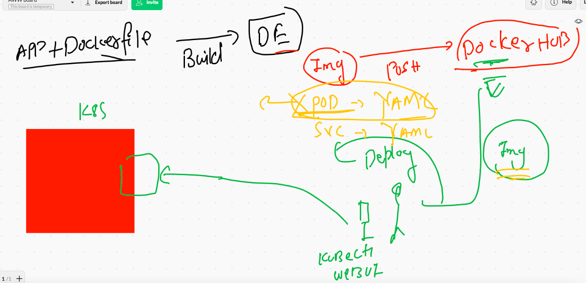
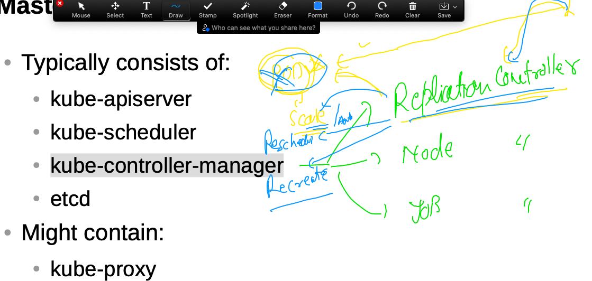
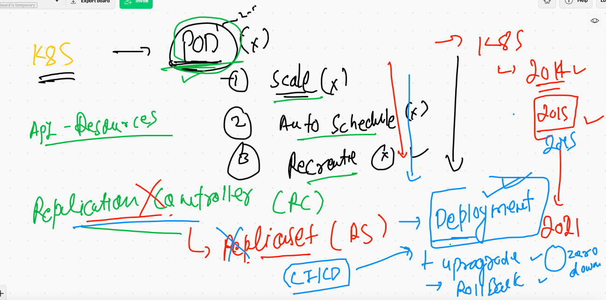
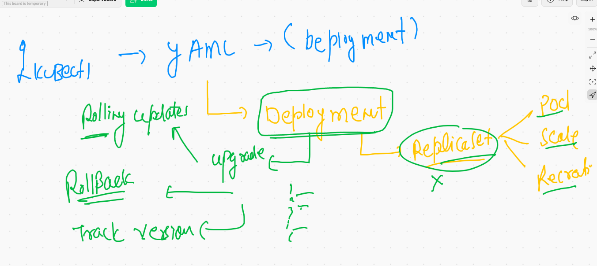

## kubernetes updates




### deployment of dashboard 

[link](https://kubernetes.io/docs/tasks/access-application-cluster/web-ui-dashboard/)


### kubernetes-dashboard listing 

```
❯ kubectl  get  ns
NAME                   STATUS   AGE
amit-project           Active   17h
anusha-project         Active   17h
ashu-project           Active   17h
chandra-project        Active   17h
default                Active   41h
dhiraj-project         Active   17h
inder                  Active   17h
isali-project          Active   17h
krishna-nd             Active   17h
kube-node-lease        Active   41h
kube-public            Active   41h
kube-system            Active   41h
kubernetes-dashboard   Active   66m
msp-name-space         Active   17h
navya-project          Active   17h
tanmay-ns              Active   17h
vishal-project         Active   17h
❯ kubectl  get svc  -n  kubernetes-dashboard
NAME                        TYPE        CLUSTER-IP      EXTERNAL-IP   PORT(S)         AGE
dashboard-metrics-scraper   ClusterIP   10.111.90.139   <none>        8000/TCP        66m
kubernetes-dashboard        NodePort    10.103.236.17   <none>        443:31739/TCP   66m

```

### understanding concept of service account and its token saved  in secret api-resources

```
❯ kubectl  get  ns
NAME                   STATUS   AGE
amit-project           Active   17h
anusha-project         Active   17h
ashu-project           Active   17h
chandra-project        Active   17h
default                Active   41h
dhiraj-project         Active   17h
inder                  Active   17h
isali-project          Active   17h
krishna-nd             Active   17h
kube-node-lease        Active   41h
kube-public            Active   41h
kube-system            Active   41h
kubernetes-dashboard   Active   70m
msp-name-space         Active   17h
navya-project          Active   17h
tanmay-ns              Active   17h
vishal-project         Active   17h
❯ kubectl  config get-contexts
CURRENT   NAME                          CLUSTER      AUTHINFO           NAMESPACE
*         kubernetes-admin@kubernetes   kubernetes   kubernetes-admin   ashu-project
          minikube                      minikube     minikube           default
❯ kubectl  get  po
NAME      READY   STATUS    RESTARTS   AGE
ashualp   1/1     Running   1          17h
❯ kubectl  get  serviceaccount
NAME      SECRETS   AGE
default   1         17h
❯ kubectl  get  sa
NAME      SECRETS   AGE
default   1         17h
❯ kubectl  get  secret
NAME                  TYPE                                  DATA   AGE
default-token-z4g2x   kubernetes.io/service-account-token   3      17h
❯ kubectl  get  secret  -n kubernetes-dashboard
NAME                               TYPE                                  DATA   AGE
default-token-mm2c8                kubernetes.io/service-account-token   3      74m
kubernetes-dashboard-certs         Opaque                                0      74m
kubernetes-dashboard-csrf          Opaque                                1      74m
kubernetes-dashboard-key-holder    Opaque                                2      74m
kubernetes-dashboard-token-ck2ls   kubernetes.io/service-account-token   3      74m
❯ kubectl  get  sa  -n kubernetes-dashboard
NAME                   SECRETS   AGE
default                1         74m
kubernetes-dashboard   1         74m

```

### service account and secret concept



### getting token of svc account 

```
10023  history
10024  kubectl  get  sa  -n kubernetes-dashboard
10025  kubectl  get  secret  -n kubernetes-dashboard
10026  kubectl  describe  secret kubernetes-dashboard-token-ck2ls    -n kubernetes-dashboard
❯ kubectl  get  secret  -n kubernetes-dashboard
NAME                               TYPE                                  DATA   AGE
default-token-mm2c8                kubernetes.io/service-account-token   3      83m
kubernetes-dashboard-certs         Opaque                                0      83m
kubernetes-dashboard-csrf          Opaque                                1      83m
kubernetes-dashboard-key-holder    Opaque                                2      83m
kubernetes-dashboard-token-ck2ls   kubernetes.io/service-account-token   3      83m

```


### Customer 1 with multi app -- 

### build docker images 

```
❯ docker  build  -t  dockerashu/ashucustomer1:v0011 -f  multiapp.dockerfile  .
[+] Building 9.0s (6/14)                                                                                  
 => [internal] load build definition from multiapp.dockerfile                                        0.4s
 => => transferring dockerfile: 674B                                                                 0.1s
 => [internal] load .dockerignore                                                                    0.1s
 => => transferring context: 202B                                                                    0.0s
 => [internal] load metadata for docker.io/library/oraclelinux:8.3                                   4.1s
 => [auth] library/ora
 
 ```
 
 ### pushing image
 
 ```
 ❯ docker  login
Authenticating with existing credentials...
Login Succeeded
❯ docker push dockerashu/ashucustomer1:v0011
The push refers to repository [docker.io/dockerashu/ashucustomer1]
a8139f66fc2f: Pushed 
5f70bf18a086: Mounted from dockerashu/httpd 
d307ee66ea8e: Pushed 
af437c039a73: Pushed 
326a33d8ebe0: Pushed 
635e640a85f7: Pushed 
644b620f1ab0: Pushed 
3289db8a21b8: Pushed 
02a3a073ed48: Mounted from library/oraclelinux 
v0011: digest: sha256:7e24d6b85885794e100895f534c40fbd591adab19851c2c7e20133c8544e7740 size: 2198

```

### we are not gonna use POD any more 



### Replication controller 



## Journey from. POd - RC - RS - Deployment 



## Reality of deployment 


### creating deployment 

```
10054  kubectl  create  deployment   ashudep1   --image=dockerashu/ashucustomer1:v0011  --dry-run=client -o yaml 
10055  kubectl  create  deployment   ashudep1   --image=dockerashu/ashucustomer1:v0011 --namespace=ashu-project  --dry-run=client -o yaml 
❯ 
❯ 
❯ kubectl  create  deployment   ashudep1   --image=dockerashu/ashucustomer1:v0011 --namespace=ashu-project  --dry-run=client -o yaml  >customer1dep.yaml

```

### deployment got deployed 

```
apiVersion: apps/v1
kind: Deployment
metadata:
  creationTimestamp: null
  labels: # label of Deployment 
    app: ashudep1
  name: ashudep1 # name of deployment 
  namespace: ashu-project # namespace info 
spec:
  replicas: 1 # no of POD we want initially 
  selector:
    matchLabels:
      app: ashudep1
  strategy: {}
  template: # Deployment will use Template to create POD
    metadata:
      creationTimestamp: null
      labels: # label of PODs
        app: ashudep1
    spec:
      containers:
      - image: dockerashu/ashucustomer1:v0011 # docker hub image 
        name: ashucustomer1 # name of container
        ports: # pod app port (optional field)
        - containerPort: 80
        env: # to create / replace values of env from docker image to container
        - name: app # this env variable is already present in docker image
          value: test1 # change value of app varible
        resources: {}
status: {}

```

###

```

❯ ls
alpine.yaml       autopod.yaml      mypod.json        tomcatsvc.yaml
ashupod1.yaml     customer1dep.yaml tomcat.yml
❯ kubectl apply -f  customer1dep.yaml --dry-run=client
deployment.apps/ashudep1 created (dry run)
❯ kubectl apply -f  customer1dep.yaml
deployment.apps/ashudep1 created

```

### deployment 

```
❯ kubectl  get  deploy
NAME       READY   UP-TO-DATE   AVAILABLE   AGE
ashudep1   1/1     1            1           3m57s
❯ 
❯ kubectl  get  rs
NAME                  DESIRED   CURRENT   READY   AGE
ashudep1-85666dcd9b   1         1         1       4m2s
❯ 
❯ 
❯ kubectl  get  po
NAME                        READY   STATUS    RESTARTS   AGE
ashudep1-85666dcd9b-zglnl   1/1     Running   0          4m6s
❯ kubectl  get  po --show-labels -o wide
NAME                        READY   STATUS    RESTARTS   AGE     IP              NODE      NOMINATED NODE   READINESS GATES   LABELS
ashudep1-85666dcd9b-zglnl   1/1     Running   0          4m18s   192.168.34.63   minion1   <none>           <none>            app=ashudep1,pod-template-hash=85666dcd9b

```

### scaling pod manually 

```
❯ kubectl  get deploy
NAME       READY   UP-TO-DATE   AVAILABLE   AGE
ashudep1   3/3     3            3           20m
❯ 
❯ 
❯ kubectl  scale deploy  ashudep1  --replicas=5
deployment.apps/ashudep1 scaled
❯ kubectl  get deploy
NAME       READY   UP-TO-DATE   AVAILABLE   AGE
ashudep1   5/5     5            5           20m
❯ kubectl get po
NAME                        READY   STATUS    RESTARTS   AGE
ashudep1-85666dcd9b-hqrjx   1/1     Running   0          64s
ashudep1-85666dcd9b-n924p   1/1     Running   0          10s
ashudep1-85666dcd9b-sl9xs   1/1     Running   0          10s
ashudep1-85666dcd9b-xjk4t   1/1     Running   0          64s
ashudep1-85666dcd9b-zglnl   1/1     Running   0          20m
❯ kubectl get po  --show-labels
NAME                        READY   STATUS    RESTARTS   AGE   LABELS
ashudep1-85666dcd9b-hqrjx   1/1     Running   0          70s   app=ashudep1,pod-template-hash=85666dcd9b
ashudep1-85666dcd9b-n924p   1/1     Running   0          16s   app=ashudep1,pod-template-hash=85666dcd9b
ashudep1-85666dcd9b-sl9xs   1/1     Running   0          16s   app=ashudep1,pod-template-hash=85666dcd9b
ashudep1-85666dcd9b-xjk4t   1/1     Running   0          70s   app=ashudep1,pod-template-hash=85666dcd9b
ashudep1-85666dcd9b-zglnl   1/1     Running   0          20m   app=ashudep1,pod-template-hash=85666dcd9b

```

### creating service for deployment 

```
❯ kubectl  create  service  nodeport  ashusvc111  --tcp  1234:80 --namespace=ashu-project  --dry-run=client -o yaml
apiVersion: v1
kind: Service
metadata:
  creationTimestamp: null
  labels:
    app: ashusvc111
  name: ashusvc111
  namespace: ashu-project
spec:
  ports:
  - name: 1234-80
    port: 1234
    protocol: TCP
    targetPort: 80
  selector:
    app: ashusvc111
  type: NodePort
status:
  loadBalancer: {}
  
  ```
  
  ##  COncpet of ingress controller 
  
  
  
  ### to create loadbalancer service just replace nodeport with loadbalancer in command 
  
  ```
   kubectl  create  service loadbalancer  ashulb1  --tcp 1234:80 
   
   ```
   
## Storage in k8s 


## k8s volume source 

[docs](https://kubernetes.io/docs/concepts/storage/volumes/)

### volumes 


### access pod with data 

```
❯ kubectl  run   ashupod9  --image=alpine  --dry-run=client -o yaml  >emp_pod.yaml
❯ kubectl get  po
NAME       READY   STATUS    RESTARTS   AGE
ashupod9   1/1     Running   0          23s
❯ kubectl  exec -it  ashupod9 -- sh
/ # cd  /mnt/oracle/
/mnt/oracle # ls
data.txt
/mnt/oracle # cat  data.txt 
Fri Jun 18 10:38:17 UTC 2021
Fri Jun 18 10:38:22 UTC 2021
Fri Jun 18 10:38:27 UTC 2021
Fri Jun 18 10:38:32 UTC 2021
Fri Jun 18 10:38:37 UTC 2021

```

### multi container pod 


### accessing container 

```
❯ kubectl  get   po
NAME       READY   STATUS    RESTARTS   AGE
ashupod9   2/2     Running   0          6s
❯ kubectl   exec  -it   ashupod9  -- sh
Defaulted container "ashuc2" out of: ashuc2, ashuc1
# 
# exit
❯ kubectl   exec  -it   ashupod9 -c ashuc1  -- sh
/ # 
/ # cat  /etc/os-release 
NAME="Alpine Linux"
ID=alpine
VERSION_ID=3.14.0
PRETTY_NAME="Alpine Linux v3.14"
HOME_URL="https://alpinelinux.org/"
BUG_REPORT_URL="https://bugs.alpinelinux.org/"
/ # 
❯ kubectl   exec  -it   ashupod9  -- sh
Defaulted container "ashuc2" out of: ashuc2, ashuc1
# cat  /etc/issue
Debian GNU/Linux 10 \n \l

# 

```

### secret password 


### creawting secret to store db password 

```
❯ kubectl  create  secret
Create a secret using specified subcommand.

Available Commands:
  docker-registry Create a secret for use with a Docker registry
  generic         Create a secret from a local file, directory or literal value
  tls             Create a TLS secret

Usage:
  kubectl create secret [flags] [options]

Use "kubectl <command> --help" for more information about a given command.
Use "kubectl options" for a list of global command-line options (applies to all commands).
❯ kubectl  create  secret  generic dbsec --from-literals  key1=OracleSec098
Error: unknown flag: --from-literals
See 'kubectl create secret generic --help' for usage.
❯ kubectl  create  secret  generic dbsec --from-literal  key1=OracleSec098
secret/dbsec created
❯ kubectl  get  secret
NAME                  TYPE                                  DATA   AGE
dbsec                 Opaque                                1      6s
default-token-z4g2x   kubernetes.io/service-account-token   3      24h

```

## history 

```
005  kubectl apply -f https://raw.githubusercontent.com/kubernetes/dashboard/v2.2.0/aio/deploy/recommended.yaml
10006  kubectl get  ns
10007  kubectl  get  po -n  kubernetes-dashboard 
10008  kubectl  get svc  -n  kubernetes-dashboard 
10009  kubectl  get  ns
10010  kubectl  get svc  -n  kubernetes-dashboard 
10011  kubectl  get  ns
10012  kubectl  config get-contexts 
10013  kubectl  get  po 
10014  kubectl  get  serviceaccount 
10015  kubectl  get  sa
10016  kubectl  get  secret
10017  kubectl  get  secret  -n kubernetes-dashboard 
10018  kubectl  get  sa  -n kubernetes-dashboard 
10019  kubectl  get  sa  -n  default
10020  kubectl  get  sa  -n  ashu-project
10021  kubectl  get  secret  -n  ashu-project
10022  kubectl  get  secret  -n  default
10023  history
10024  kubectl  get  sa  -n kubernetes-dashboard
10025  kubectl  get  secret  -n kubernetes-dashboard
10026  kubectl  describe  secret kubernetes-dashboard-token-ck2ls    -n kubernetes-dashboard
10027  history
10028  kubectl  get  secret  -n kubernetes-dashboard
10029  history
10030  kubectl  get  secret  -n kubernetes-dashboard
10031  kubectl  describe  secret kubernetes-dashboard-token-ck2ls    -n kubernetes-dashboard
10032  history
10033  kubectl  get  secret  -n kubernetes-dashboard
10034  kubectl get po --show-labels
10035* ls
10036* cd  customer1
10037* ls
10038* docker  build  -t  dockerashu/ashucustomer1:v0011 -f  multiapp.dockerfile  . 
10039  history
10040  docker  login 
10041  docker push dockerashu/ashucustomer1:v0011
10042  docker  context ls
10043  docker  version 
10044  history
10045  kubectl  get  po 
10046  kubectl  get  all
10047  kubectl  delete pods --all
10048  cd  Desktop
10049  ls
10050  cd  myimages
10051  ls
10052  cd  k8sapps
10053  ls
10054  kubectl  create  deployment   ashudep1   --image=dockerashu/ashucustomer1:v0011  --dry-run=client -o yaml 
10055  kubectl  create  deployment   ashudep1   --image=dockerashu/ashucustomer1:v0011 --namespace=ashu-project  --dry-run=client -o yaml 
10056  history
10057  kubectl  create  deployment   ashudep1   --image=dockerashu/ashucustomer1:v0011 --namespace=ashu-project  --dry-run=client -o yaml  >customer1dep.yaml
10058  history
10059* ls
10060* cd  k8sapps
10061* ls
10062* kubectl apply -f  customer1dep.yaml --dry-run=client 
10063* kubectl apply -f  customer1dep.yaml
10064  history
10065  kubectl  get  deployment 
10066  kubectl  delete  deploy raj1 
10067  kubectl  get  deploy 
10068  history
10069  kubectl  get  deploy 
10070  kubectl  get  deployment 
10071  kubectl  get  deployments 
10072  kubectl  get  deploy
10073  kubectl  get  rs
10074  kubectl  get  po
10075  kubectl  get  po --show-labels -o wide
10076  history
10077  kubectl  get  deploy 
10078  kubectl  get  po 
10079  kubectl  get  rs
10080  kubectl  get  po 
10081  kubectl  get  ns
10082  kubectl  get  po -n  navya-project 
10083  kubectl  logs  -n  navya-project 
10084  kubectl  logs navyadep1-868fcf6c88-bzh77   -n  navya-project 
10085  kubectl  describe  pod navyadep1-868fcf6c88-bzh77   -n  navya-project 
10086  docker run -it --rm --entrypoint bash navyas1388/navyacustome:v001 
10087  history
10088  kubectl  describe  secret kubernetes-dashboard-token-ck2ls    -n kubernetes-dashboard
10089  history
10090  vim /tmp/is.yml
10091  kubectl  get deploy 
10092  kubectl  scale deploy  ashudep1  --replicas=5
10093  kubectl  get deploy 
10094  kubectl get po 
10095  kubectl get po  --show-labels 
10096  history
10097  kubectl  scale deploy  ashudep1 --replicas=2
10098  kubectl  create  service  nodeport  ashusvc111  --tcp  1234:80 --namespace=ashu-project  --dry-run=client -o yaml 
10099* cd  k8sapps
10100* ls
10101* kubectl  apply -f  customer1dep.yaml
10102  kubectl  get  deploy
10103  kubectl  get  svc
10104  history
10105  kubectl get po 
10106  kubectl  scale deploy  ashudep1 --replicas=2
10107  history
10108  kubectl  get  ns
10109  kubectl  get  po,svc -n amit-project 
10110  kubectl  get svc
10111  kubectl  create  service loadbalancer  ashulb1  --tcp 1234:80  
10112  kubectl get  svc 
10113  history
10114  kubectl get  svc 
10115  minikube ip 
10116  history  |   grep -i port
10117  history
10118  kubectl get  svc 
10119  kubectl  explain pod 
10120  kubectl  explain pod.spec  
10121  history
10122  kubectl help --pod 
10123  kubectl run --help
10124  kubectl  delete all --all
10125  kubectl  run   ashupod9  --image=alpine  --dry-run=client -o yaml  >emp_pod.yaml
10126* cd k8sapps
10127* ls
10128* kubectl  apply -f  emp_pod.yaml --dry-run=client 
10129* kubectl  apply -f  emp_pod.yaml
10130  kubectl get  po 
10131  kubectl  exec -it  ashupod9 -- sh 
10132  history
10133  kubectl  get  po 
10134  kubectl delete pod msppod9 
10135  kubectl  exec -it  ashupod9 -- sh 
10136  history
10137  ls
10138  kubectl  apply -f  emp_pod.yaml
10139  kubectl replace  -f  emp_pod.yaml  --force
10140  kubectl  get   po 
10141  kubectl   exec  -it   ashupod9  -- sh  
10142  kubectl   exec  -it   ashupod9 -c ashuc1  -- sh  
10143  kubectl   exec  -it   ashupod9  -- sh  
10144  kubectl   exec  -it   ashupod9  -- bash 
10145  history
10146  kubectl   exec  -it   ashupod9  -- bash 
10147  kubectl   exec  -it   ashupod9 -c ashuc1  -- sh  
10148  history
10149  kubectl   exec  -it   ashupod9  -- bash 
10150  clear
10151  history
10152  kubectl  get  po 
10153  history
10154  kubectl   exec  -it   ashupod9  -- bash
10155  kubectl   exec  -it   ashupod9  -c ashuc1 -- bash
10156  history
10157  clear
10158* cd
10159* ssh  ec2-user@100.25.159.120  -i Downloads/macdocker.pem 
10160  kubectl  create  deployment  db1  --image=mysql:5.6  --dry-run=client -o yaml  >microservice.yml
10161  kubectl  create  deployment  db1  --image=mysql:5.6  --namespace=ashu-project --dry-run=client -o yaml  >microservice.yml
10162  kubectl  get  secret 
10163  kubectl  get  sa
10164  kubectl  create  secret 
10165  kubectl  create  secret  generic dbsec --from-literals  key1=OracleSec098 
10166  kubectl  create  secret  generic dbsec --from-literal  key1=OracleSec098 
10167  kubectl  get  secret 
10168  history
10169  kubectl  get  secret 
10170  ls
10171  kubectl  apply -f  microservice.yml 
10172  kubectl get  po 
10173  kubectl get  po  -w
10174  kubectl  logs  -f db1-df5f6d7c7-fqfm2 
10175  history
10176  kubectl  get deploy 
10177  kubectl  create  service 
10178  kubectl  get  deploy 
10179  kubectl  expose  deploy  db1   --type ClusterIP  --port 3306 --dry-run=client -o yaml 
10180  ls
10181  kubectl  apply -f  microservice.yml 
10182  kubectl  get deploy 
10183  kubectl  get  svc
10184  kubectl  create  deployment  ashuwebapp  --image=wordpress:4.8-apache  --dry-run=client -o yaml 
10185  kubectl get  svc
10186  history
10187  kubectl apply -f microservice.yml
10188  kubectl get deploy 
10189  kubectl get  po 
10190  kubectl get deploy 
10191  kubectl  get  svc
10192  kubectl  get  deploy 
10193  kubectl  expose deploy  ashuwebapp --type NodePort --port 80 --dry-run=client -o yaml
10194  kubectl apply -f microservice.yml
10195  kubectl  get deploy
10196  kubectl  get  po
10197  kubectl  get svc
10198  kubectl  exec -it  db1-df5f6d7c7-fqfm2  -- bash

```


