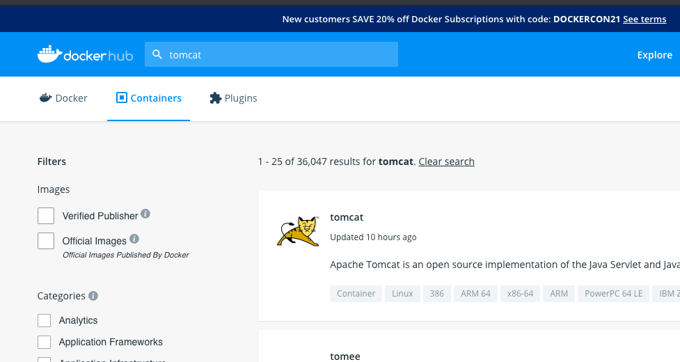
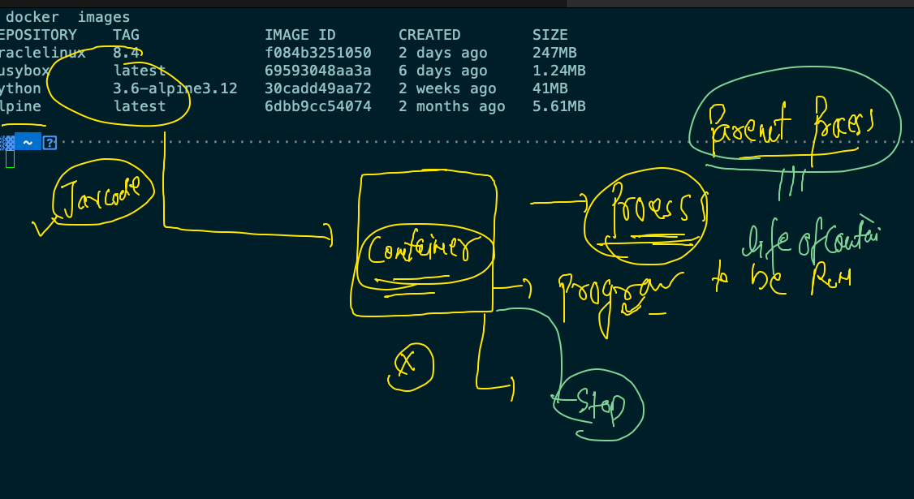
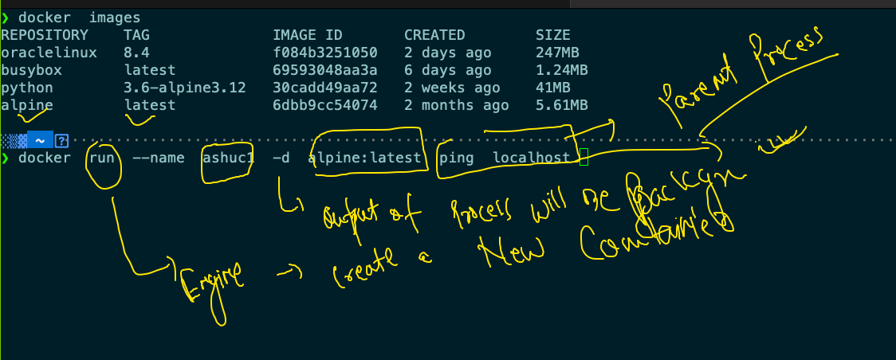
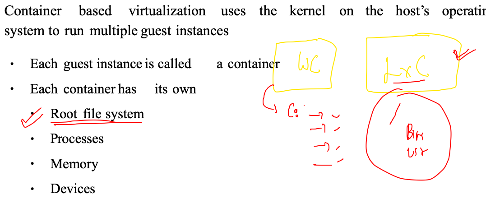

# Docker getting started 

## Normal discussion 

 

### application not compatible 


### Introduction to virtual machine 


## moving towards containers


### hypervisor vs contrainer run time engine 


### a glimpse of an OS 


## Introduction to CRE 


## Docker products


### Docker supported kernels 


## DOCKER DESKTOP 


## DOcker Desktop in windows 10 

[download](https://docs.docker.com/docker-for-windows/install/)

## Docker Desktop for mac 

[Download](https://www.docker.com/products/docker-desktop)


## After mac and windows 10 Docker Desktop  installation and start 

### checking thing 

### open terminal and type 

```
❯ docker  version
Client:
 Cloud integration: 1.0.14
 Version:           20.10.6
 API version:       1.41
 Go version:        go1.16.3
 Git commit:        370c289
 Built:             Fri Apr  9 22:46:57 2021
 OS/Arch:           darwin/amd64
 Context:           default
 Experimental:      true

Server: Docker Engine - Community
 Engine:
  Version:          20.10.6
  API version:      1.41 (minimum version 1.12)
  Go version:       go1.13.15
  Git commit:       8728dd2
  Built:            Fri Apr  9 22:44:56 2021
  OS/Arch:          linux/amd64
  Experimental:     false
 containerd:
  Version:          1.4.4
  GitCommit:        05f951a3781f4f2c1911b05e61c160e9c30eaa8e
 runc:
```

## Installing Docker in Linux server 

```
[root@ip-172-31-23-60 ~]# yum install  docker  -y
Failed to set locale, defaulting to C
Loaded plugins: extras_suggestions, langpacks, priorities, update-motd
amzn2-core                                                                                             | 3.7 kB  00:00:00     
Resolving Dependencies
--> Running transaction check
---> Package docker.x86_64 0:20.10.4-1.amzn2 will be installed
--> Processing Dependency: runc >= 1.0.0 for package: docker-20.10.4-1.amzn2.x86_64
--> Processing Dependency: libcgroup >= 0.40.rc1-5.15 for package: docker-20.10.4-1.amzn2.x86_64
--> Processing Dependency: containerd >= 1.3.2 for package: docker-20.10.4-1.amzn2.x86_64
--> Processing Dependency: pigz for package: docker-20.10.4-1.amzn2.x86_64
--> Running transaction check
---> Package containerd.x86_64 0:1.4.4-1.amzn2 will be installed
---> Package libcgroup.x86_64 0:0.41-21.amzn2 will be installed
---> Package pigz.x86_64 0:2.3.4-1.amzn2.0.1 will be installed
---> Package runc.x86_64 0:1.0.0-0.3.20210225.git12644e6.amzn2 will be installed
--> Finished Dependency Resolution


```

## Client and server connection in Docker 


## Generating key pair 

```
❯ ssh-keygen
Generating public/private rsa key pair.
Enter file in which to save the key (/Users/fire/.ssh/id_rsa): 
/Users/fire/.ssh/id_rsa already exists.
Overwrite (y/n)? y
Enter passphrase (empty for no passphrase): 
Enter same passphrase again: 
Your identification has been saved in /Users/fire/.ssh/id_rsa.
Your public key has been saved in /Users/fire/.ssh/id_rsa.pub.
The key fingerprint is:
SHA256:kh7LgXvWXSXslCEiR/JPhMDs//PMg0UCX3eDUZn7yI8 fire@ashutoshhs-MacBook-Air.local
The key's randomart image is:
+---[RSA 3072]----+
|     o+o+.o ..+.o|
|      o=oo o.+.+.|
|     .  .o..=...o|
|     ... ooo.o . |
|    . =.S .oo. ..|
|     + *.. .. o .|
|    . * ...o   o |
|     o    +o. E .|
|           o+.   |
+----[SHA256]-----+


```

### Copy key 

```
❯ ssh-copy-id   test@54.242.142.161
/usr/bin/ssh-copy-id: INFO: Source of key(s) to be installed: "/Users/fire/.ssh/id_rsa.pub"
/usr/bin/ssh-copy-id: INFO: attempting to log in with the new key(s), to filter out any that are already installed
/usr/bin/ssh-copy-id: INFO: 1 key(s) remain to be installed -- if you are prompted now it is to install the new keys
test@54.242.142.161's password: 
/etc/profile.d/lang.sh: line 19: warning: setlocale: LC_CTYPE: cannot change locale (UTF-8): No such file or directory

Number of key(s) added:        1

Now try logging into the machine, with:   "ssh 'test@54.242.142.161'"
and check to make sure that only the key(s) you wanted were added.

```

### final step to create connection from client and connect 

```
❯ docker  context  create   myawsDE --docker  host="ssh://test@54.242.142.161"
myawsDE
Successfully created context "myawsDE"
❯ 
❯ docker  context  use  myawsDE
myawsDE
❯ docker  version
Client:
 Cloud integration: 1.0.14
 Version:           20.10.6
 API version:       1.41
 Go version:        go1.16.3
 Git commit:        370c289
 Built:             Fri Apr  9 22:46:57 2021
 OS/Arch:           darwin/amd64
 Context:           myawsDE
 Experimental:      true

Server:
 Engine:
  Version:          20.10.4
  API version:      1.41 (minimum version 1.12)
  Go version:       go1.15.8
  Git commit:       363e9a8
  Built:            Mon Mar 29 18:55:03 202
  
  
  
 ```

## Switching context from docker client side 

```
❯ docker  context  ls
NAME                TYPE                DESCRIPTION                               DOCKER ENDPOINT               KUBERNETES ENDPOINT                    ORCHESTRATOR
default *           moby                Current DOCKER_HOST based configuration   unix:///var/run/docker.sock   https://52.73.214.189:6443 (default)   swarm
myawsDE             moby                                                          ssh://test@54.242.142.161                                            
❯ docker  context    use  myawsDE
myawsDE
❯ docker  context  ls
NAME                TYPE                DESCRIPTION                               DOCKER ENDPOINT               KUBERNETES ENDPOINT                    ORCHESTRATOR
default             moby                Current DOCKER_HOST based configuration   unix:///var/run/docker.sock   https://52.73.214.189:6443 (default)   swarm
myawsDE *           moby                                                          ssh://test@54.242.142.161                                          

```

 ## Docker hub the Image registry server  to store docker images 
 
 ## searching images on docker hub 
 
 


### search 

```
10041  docker  version 
❯ docker  search  mysql
NAME                              DESCRIPTION                                     STARS     OFFICIAL   AUTOMATED
mysql                             MySQL is a widely used, open-source relation…   10991     [OK]       
mariadb                           MariaDB Server is a high performing open sou…   4161      [OK]       
mysql/mysql-server                Optimized MySQL Server Docker images. Create…   815                  [OK]
centos/mysql-57-centos7           MySQL 5.7 SQL database server                   88                   
mysql/mysql-cluster               Experimental MySQL Cluster Docker images. Cr…   85                   
centurylink/mysql                 Image containing mysql. Optimized to be link…   59                   [OK]
bitnami/mysql                     Bitnami MySQL Docker Image                      52                   [OK]
databack/mysql-backup             Back up mysql databases to... anywhere!         44                   
deitch/mysql-backup               REPLACED! Please use http://hub.docker.com/r…   41        

```

### checking images on docker engine machine 

```
❯ docker  images
REPOSITORY   TAG       IMAGE ID   CREATED   SIZE

░▒▓ ~ ····································································································· 03:02:56 PM ▓▒░─╮
❯                                                                                                                            ─╯


```

### pulling images 

```
❯ docker  images
REPOSITORY   TAG       IMAGE ID       CREATED       SIZE
python       latest    5b3b4504ff1f   2 weeks ago   886MB
❯ docker  pull   alpine
Using default tag: latest
latest: Pulling from library/alpine
540db60ca938: Pull complete 
Digest: sha256:69e70a79f2d41ab5d637de98c1e0b055206ba40a8145e7bddb55ccc04e13cf8f
Status: Downloaded newer image for alpine:latest
docker.io/library/alpine:latest
❯ docker  images
REPOSITORY   TAG       IMAGE ID       CREATED        SIZE
python       latest    5b3b4504ff1f   2 weeks ago    886MB
alpine       latest    6dbb9cc54074   2 months ago   5.61MB
❯ docker  pull   busybox
Using default tag: latest
latest: Pulling from library/busybox
b71f96345d44: Pull complete 
Digest: sha256:930490f97e5b921535c153e0e7110d251134cc4b72bbb8133c6a5065cc68580d
Status: Downloaded newer image for busybox:latest
docker.io/library/busybox:latest
❯ docker  images
REPOSITORY   TAG       IMAGE ID       CREATED        SIZE
busybox      latest    69593048aa3a   6 days ago     1.24MB
python       latest    5b3b4504ff1f   2 weeks ago    886MB
alpine       latest    6dbb9cc54074   2 months ago   5.61MB

```

## role of parent process for a container 

### life of container 




### most simplest container 



## Now container in more details

### has file system 



```
❯ docker   exec -it   ashuc1  sh
/ # 
/ # ls  /
bin    dev    etc    home   lib    media  mnt    opt    proc   root   run    sbin   srv    sys    tmp    usr    var
/ # 

```

### has its own process

```
/ # ps   -e
PID   USER     TIME  COMMAND
    1 root      0:00 ping localhost
    
```

### has its own memory 

```
 docker  stats  ashuc1
 
 ```
 
 ### checking output of a running container parent process
 
 ```
  docker  logs   ashuc1 
  
   docker  logs  -f  ashuc1  # live output 
   
 ```

### stopping container manually 

```
❯ docker  stop  ashuc1
ashuc1
```

### listing all the containers 

```
❯ docker  ps  -a
CONTAINER ID   IMAGE                 COMMAND            CREATED          STATUS                            PORTS                    NAMES
1fd15065ac70   portainer/portainer   "/portainer"       11 minutes ago   Up About a minute                 0.0.0.0:9000->9000/tcp   charming_borg
d8701ab4c890   alpine:latest         "ping localhost"   20 minutes ago   Exited (137) 35 seconds ago                                isali
fc28f04d228f   alpine:latest         "ping localhost"   21 minutes ago   Exited (137) About a minute ago                            amit2
d8f04d5d4c0b   alpine:latest         "ping localhost"   21 minutes ago   Exited (137) About a minute ago                            CT2
ffc7c40861a5   alpine:latest         "ping localhost"   24 minutes ago   Up 24 minutes                                              anusha
e5855a0c20e9   alpine:latest         "ping localhost"   24 minutes ago   Up 24 minutes                                              thedocker
fe9c1e12b5da   alpine:latest         "ping localhost"   38 minutes ago   Up 38 minutes                                              testc
b0271bb625ed   alpine:latest         "ping localhost"   38 minutes ago   Exited (137) About a minute ago                            tanmay1
d8d5c01ca07f   alpine:latest    

```


### starting a container 

```
❯ docker  start  ashuc1
ashuc1
❯ docker ps
CONTAINER ID   IMAGE                 COMMAND            CREATED          STATUS          PORTS                    NAMES
1fd15065ac70   portainer/portainer   "/portainer"       12 minutes ago   Up 2 minutes    0.0.0.0:9000->9000/tcp   charming_borg
fc28f04d228f   alpine:latest         "ping localhost"   22 minutes ago   Up 1 second                              amit2
e5855a0c20e9   alpine:latest         "ping localhost"   25 minutes ago   Up 25 minutes                            thedocker
fe9c1e12b5da   alpine:latest         "ping localhost"   39 minutes ago   Up 39 minutes                            testc
4deb5a15f688   alpine:latest         "ping localhost"   42 minutes ago   Up 42 minutes                            dhiraj1
764c21238229   alpine:latest         "ping localhost"   42 minutes ago   Up 4 seconds                             ashuc1

```

### deleting container 

```
❯ docker  kill  ashuc1
ashuc1
❯ docker  rm ashuc1
ashuc1
❯ docker  start  ashuc1
Error response from daemon: No such container: ashuc1
Error: failed to start containers: ashuc1

```

### from a running container to image

```
❯ docker  commit  4deb5a15f688  aa:v1
sha256:da305b194ee8567418d9a175cdeaf3036a349e4e400d38bb1cab22c1c1b21926
❯ docker  images
REPOSITORY            TAG              IMAGE ID       CREATED         SIZE
aa                    v1               da305b194ee8   5 seconds ago   5.61MB

```


