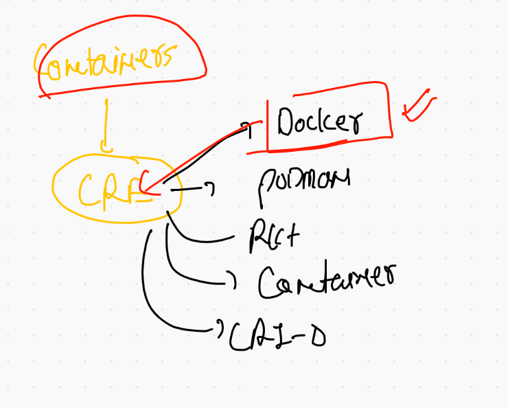
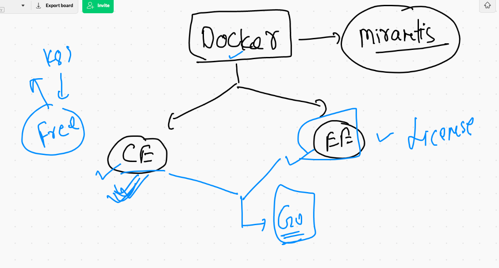
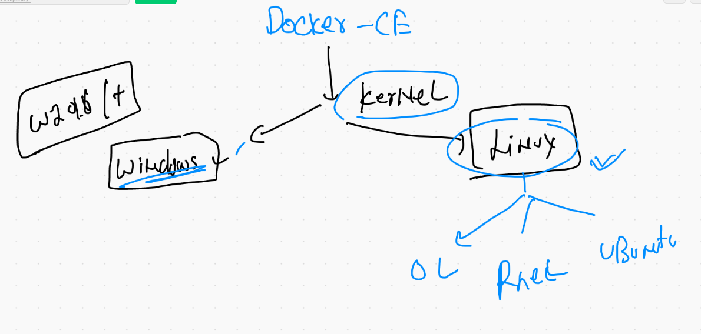
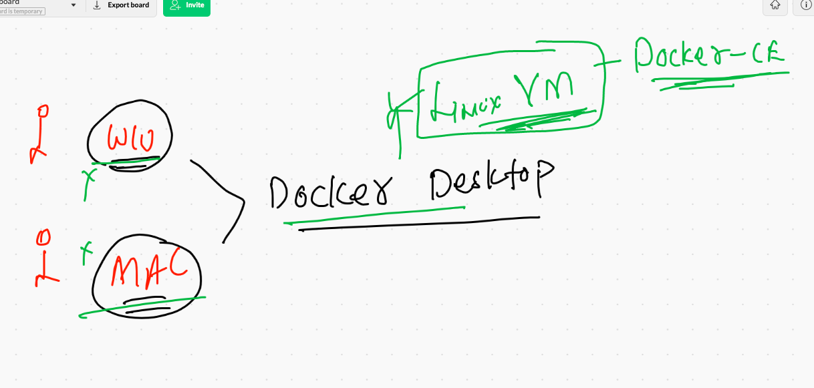
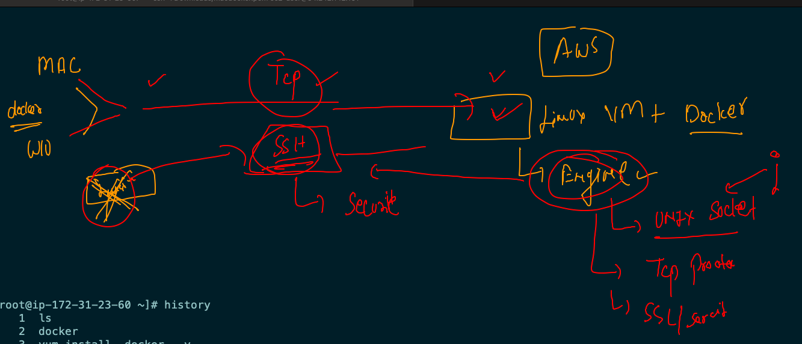

# Docker getting started 

## Normal discussion 

 

### application not compatible 


### Introduction to virtual machine 


## moving towards containers


### hypervisor vs contrainer run time engine 


### a glimpse of an OS 


## Introduction to CRE 



## Docker products



### Docker supported kernels 



## DOCKER DESKTOP 



## DOcker Desktop in windows 10 

[download](https://docs.docker.com/docker-for-windows/install/)

## Docker Desktop for mac 

[Download](https://www.docker.com/products/docker-desktop)


## After mac and windows 10 Docker Desktop  installation and start 

### checking thing 

### open terminal and type 

```
❯ docker  version
Client:
 Cloud integration: 1.0.14
 Version:           20.10.6
 API version:       1.41
 Go version:        go1.16.3
 Git commit:        370c289
 Built:             Fri Apr  9 22:46:57 2021
 OS/Arch:           darwin/amd64
 Context:           default
 Experimental:      true

Server: Docker Engine - Community
 Engine:
  Version:          20.10.6
  API version:      1.41 (minimum version 1.12)
  Go version:       go1.13.15
  Git commit:       8728dd2
  Built:            Fri Apr  9 22:44:56 2021
  OS/Arch:          linux/amd64
  Experimental:     false
 containerd:
  Version:          1.4.4
  GitCommit:        05f951a3781f4f2c1911b05e61c160e9c30eaa8e
 runc:
```

## Installing Docker in Linux server 

```
[root@ip-172-31-23-60 ~]# yum install  docker  -y
Failed to set locale, defaulting to C
Loaded plugins: extras_suggestions, langpacks, priorities, update-motd
amzn2-core                                                                                             | 3.7 kB  00:00:00     
Resolving Dependencies
--> Running transaction check
---> Package docker.x86_64 0:20.10.4-1.amzn2 will be installed
--> Processing Dependency: runc >= 1.0.0 for package: docker-20.10.4-1.amzn2.x86_64
--> Processing Dependency: libcgroup >= 0.40.rc1-5.15 for package: docker-20.10.4-1.amzn2.x86_64
--> Processing Dependency: containerd >= 1.3.2 for package: docker-20.10.4-1.amzn2.x86_64
--> Processing Dependency: pigz for package: docker-20.10.4-1.amzn2.x86_64
--> Running transaction check
---> Package containerd.x86_64 0:1.4.4-1.amzn2 will be installed
---> Package libcgroup.x86_64 0:0.41-21.amzn2 will be installed
---> Package pigz.x86_64 0:2.3.4-1.amzn2.0.1 will be installed
---> Package runc.x86_64 0:1.0.0-0.3.20210225.git12644e6.amzn2 will be installed
--> Finished Dependency Resolution


```

## Client and server connection in Docker 




## Generating key pair 

```
❯ ssh-keygen
Generating public/private rsa key pair.
Enter file in which to save the key (/Users/fire/.ssh/id_rsa): 
/Users/fire/.ssh/id_rsa already exists.
Overwrite (y/n)? y
Enter passphrase (empty for no passphrase): 
Enter same passphrase again: 
Your identification has been saved in /Users/fire/.ssh/id_rsa.
Your public key has been saved in /Users/fire/.ssh/id_rsa.pub.
The key fingerprint is:
SHA256:kh7LgXvWXSXslCEiR/JPhMDs//PMg0UCX3eDUZn7yI8 fire@ashutoshhs-MacBook-Air.local
The key's randomart image is:
+---[RSA 3072]----+
|     o+o+.o ..+.o|
|      o=oo o.+.+.|
|     .  .o..=...o|
|     ... ooo.o . |
|    . =.S .oo. ..|
|     + *.. .. o .|
|    . * ...o   o |
|     o    +o. E .|
|           o+.   |
+----[SHA256]-----+


```

### Copy key 

```
❯ ssh-copy-id   test@54.242.142.161
/usr/bin/ssh-copy-id: INFO: Source of key(s) to be installed: "/Users/fire/.ssh/id_rsa.pub"
/usr/bin/ssh-copy-id: INFO: attempting to log in with the new key(s), to filter out any that are already installed
/usr/bin/ssh-copy-id: INFO: 1 key(s) remain to be installed -- if you are prompted now it is to install the new keys
test@54.242.142.161's password: 
/etc/profile.d/lang.sh: line 19: warning: setlocale: LC_CTYPE: cannot change locale (UTF-8): No such file or directory

Number of key(s) added:        1

Now try logging into the machine, with:   "ssh 'test@54.242.142.161'"
and check to make sure that only the key(s) you wanted were added.

```

### final step to create connection from client and connect 

```
❯ docker  context  create   myawsDE --docker  host="ssh://test@54.242.142.161"
myawsDE
Successfully created context "myawsDE"
❯ 
❯ docker  context  use  myawsDE
myawsDE
❯ docker  version
Client:
 Cloud integration: 1.0.14
 Version:           20.10.6
 API version:       1.41
 Go version:        go1.16.3
 Git commit:        370c289
 Built:             Fri Apr  9 22:46:57 2021
 OS/Arch:           darwin/amd64
 Context:           myawsDE
 Experimental:      true

Server:
 Engine:
  Version:          20.10.4
  API version:      1.41 (minimum version 1.12)
  Go version:       go1.15.8
  Git commit:       363e9a8
  Built:            Mon Mar 29 18:55:03 202
  
  
  
 ```


